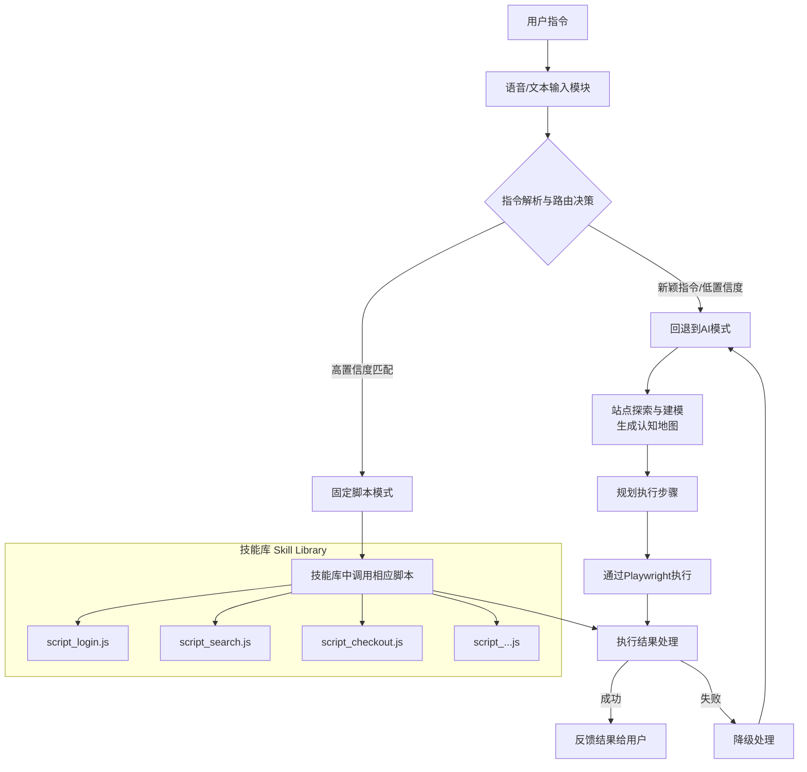

# Aura 完整解决方案

## 项目概述

### 项目愿景
构建一个通过自然语言（语音/文本）指令操作浏览器的智能系统，能够理解用户意图，在复杂网站中可靠地执行多步任务，如同一个数字助手。

### 核心价值
- **无障碍交互**：通过自然语言降低自动化操作的技术门槛
- **智能导航**：在未知或复杂网站中自主探索和定位目标
- **稳定执行**：结合AI灵活性与脚本可靠性，实现工业级稳定性
- **高效复用**：将成功操作固化为可共享的"技能"，持续积累价值

## 系统架构

本系统采用"混合智能"架构，结合AI的认知能力与脚本的执行可靠性，其完整工作流程如下：



## 架构设计说明 (ADR)

### ADR-1 混合智能架构
- **决策**：保留"AI动态规划 + 固定脚本"双模式，新增 Orchestrator、Policy Engine、Skill Library、Site Model Registry
- **动机**：提高扩展性、风险可控性和沉淀能力
- **后果**：架构更复杂，但具备可持续迭代基础

### ADR-2 Action Graph
- **决策**：AI 输出先转化为 Action Graph（DAG），再执行
- **动机**：可验证、可重放、可迁移
- **后果**：需要 Schema 和编译器，但能形成稳定执行基座

### ADR-3 技能包（Skill Pack）
- **决策**：固定脚本系统升级为 Skill Pack（Manifest + 参数Schema + 断言 + 可观测性）
- **动机**：形成标准化技能生态
- **后果**：需注册中心与沉淀流水线

### ADR-4 Site Model Registry
- **决策**：探索结果存入模型仓库（语义定位符+版本化）
- **动机**：抗选择器漂移，支持增量与回滚
- **后果**：需存储与TTL治理

### ADR-5 Policy & Risk Engine
- **决策**：高风险操作强制走策略引擎，人审/多因子
- **动机**：确保安全合规
- **后果**：可能增加交互摩擦

### ADR-6 Observability & Replay
- **决策**：执行链全量日志+截图+回放
- **动机**：调试与审计友好
- **后果**：增加存储成本

## 核心模块详解

### 语音/文本输入模块
- **语音识别**：使用Web Speech API或华为云语音服务
- **文本接口**：提供简洁的聊天式界面
- **指令队列**：支持多指令排队和优先级管理

### 指令解析与路由决策

```jsx
// 决策逻辑示例
async function decideExecutionStrategy(userCommand) {
  const analysis = await llmAnalyze(userCommand);

  // 检查是否有高置信度脚本匹配
  const scriptMatch = findScriptMatch(analysis.intent, analysis.parameters);

  if (scriptMatch && scriptMatch.confidence > 0.85) {
    return {
      mode: 'script',
      scriptId: scriptMatch.id,
      parameters: scriptMatch.parameters
    };
  } else {
    return {
      mode: 'ai_agent',
      plan: analysis.suggested_plan
    };
  }
}
```

### 站点探索与建模引擎

**探索策略**：
- 广度优先遍历发现所有主要页面
- 交互式探索（点击、悬停、输入）
- 关键元素捕获与分类

**站点模型结构**：
```json
{
  "metadata": {
    "domain": "example.com",
    "lastExplored": "2024-06-01T10:30:00Z",
    "version": "1.2"
  },
  "pages": {
    "homepage": {
      "url": "/",
      "description": "网站主页，包含主导航和搜索功能",
      "elements": {
        "searchBox": {
          "selectors": ["#searchInput", ".search-field"],
          "type": "text_input",
          "purpose": "全局搜索"
        }
      }
    }
  },
  "navigationGraph": {
    "homepage": ["searchResults", "productCategory", "loginPage"]
  }
}
```

### 固定脚本系统（升级为Skill Pack）

**Skill Pack Manifest 示例**：
```json
{
  "id": "example.search",
  "version": "1.0.0",
  "target": ["example.com"],
  "inputs": {
    "productName": {"type": "string", "required": true}
  },
  "assertions": [{ "name": "HasResults", "selector": "#results", "timeoutMs": 10000 }],
  "observability": { "captureScreenshot": "onError|onCheckpoint" },
  "examples": [{ "inputs": {"productName": "Kindle"}, "goldenOutputHash": "sha256:dummyhash" }],
  "permissions": ["readPublic"],
  "signatures": {"author": "radial", "checksum": "sha256:placeholder"}
}
```

### 执行引擎 (Playwright MCP)
- **浏览器管理**：多实例、上下文隔离
- **操作执行**：点击、输入、导航、提取等原子操作
- **状态监控**：网络活动、页面加载、元素状态
- **错误恢复**：超时处理、重试机制、异常捕获

### Action Graph 执行器
```python
from playwright.sync_api import sync_playwright

class Executor:
    def __init__(self, graph):
        self.graph = graph

    def run(self):
        with sync_playwright() as p:
            browser = p.chromium.launch(headless=False)
            page = browser.new_page()
            try:
                for node in self.graph["nodes"]:
                    if node["type"] == "navigate":
                        page.goto(node["url"])
                    elif node["type"] == "type":
                        page.fill(node["locator"], node["text"])
                    elif node["type"] == "click":
                        page.click(node["locator"])
                    elif node["type"] == "assert":
                        page.wait_for_selector(node["locator"], timeout=5000)
                print("Action Graph completed successfully!")
            finally:
                browser.close()
```

### Action Graph 示例
```json
{
  "goal": "search_product",
  "nodes": [
    {"id": "openHome", "type": "navigate", "url": "https://example.com"},
    {"id": "findSearch", "type": "locate", "locator": "input[name='q']"},
    {"id": "fill", "type": "type", "locator": "input[name='q']", "text": "Kindle"},
    {"id": "submit", "type": "click", "locator": "button[type='submit']"},
    {"id": "assertResults", "type": "assert", "locator": "#results"}
  ],
  "edges": [
    {"from": "openHome", "to": "findSearch"},
    {"from": "findSearch", "to": "fill"},
    {"from": "fill", "to": "submit"},
    {"from": "submit", "to": "assertResults"}
  ],
  "budgetTokens": 3000
}
```

### 反馈与确认系统
- **视觉反馈**：操作高亮、进度指示、结果展示
- **语音反馈**：使用TTS播报重要状态变化
- **确认机制**：高风险操作前的用户确认
- **日志系统**：详细的操作日志和审计跟踪

## 接口文档

### Orchestrator API
- `POST /jobs` → 创建任务
  ```json
  { "goal": "string", "constraints": {}, "riskLevel": "low|high", "budgetTokens": 3000, "siteScope": "domain" }
  ```
- `GET /jobs/{id}` → 查询状态
- `POST /jobs/{id}/replay` → 回放任务

### Skill Library API
- `POST /skills/publish` → 发布技能
- `GET /skills/{id}` → 查询技能详情

### Site Model Registry API
- `POST /models/update` → 提交新模型
- `GET /models/{domain}@{version}` → 获取模型

### Action Graph Schema (简化)
```json
{
  "goal": "string",
  "nodes": [
    { "id": "string", "type": "navigate|click|type|assert", "locator": "string", "text": "string" }
  ],
  "edges": [{ "from": "string", "to": "string" }],
  "budgetTokens": 3000
}
```

## 实施路线图

### 阶段一：基础框架搭建 (MVP 2-3周)
- [ ] 跑通搜索→详情任务
- [ ] ≥95% 成功率，≤2 次重试
- [ ] 日志含截图
- [ ] 无敏感数据落盘
- **技术栈配置**：设置Playwright MCP Server、Node.js环境
- **基础交互**：实现文本指令输入和简单操作（点击、导航）
- **AI集成**：配置LLM连接和基本指令解析
- **反馈机制**：实现基本的结果反馈和错误处理

### 阶段二：核心智能实现 (建模 3-4周)
- [ ] Site Model Registry v1 完成
- [ ] 语义定位符通过 UI 扰动测试
- [ ] Action Graph IR 校验 100%
- **站点探索器**：开发自动网站探索和建模功能
- **模型管理**：实现站点模型的存储、版本和查询
- **智能路由**：开发决策器，选择最佳执行策略
- **脚本系统**：设计固定脚本格式和注册机制

### 阶段三：高级功能与优化 (技能沉淀 4-5周)
- [ ] AI → Skill Pack 自动生成
- [ ] 技能灰度上线成功
- [ ] 可视化回放+对比报告
- **语音接口**：集成语音识别和TTS功能
- **性能优化**：实现并发执行、缓存和资源管理
- **用户界面**：开发浏览器扩展或独立UI
- **测试覆盖**：编写全面测试用例，覆盖主要场景

### 阶段四：生产环境部署 (生产与风控 2-3周)
- [ ] Policy Engine 上线
- [ ] Observability 全链路
- [ ] 运维手册完成
- **安全加固**：实施权限控制、输入验证和防注入
- **监控日志**：添加详细日志记录和性能监控
- **部署打包**：创建安装包和部署脚本
- **文档编写**：准备用户文档和开发文档

## 指标体系
- 成功率、重试率、延迟 P50/P95
- 人审率、Token 成本/任务
- 模型更新频率、技能转化率、回滚次数

## 潜在挑战与解决方案

### 技术挑战
1. **网站动态性**：
    - 挑战：网站结构变化导致元素选择器失效
    - 解决方案：多备用选择器、视觉定位、定期模型更新
2. **性能问题**：
    - 挑战：大规模网站探索耗时较长
    - 解决方案：增量探索、优先级队列、分布式执行
3. **跨浏览器兼容**：
    - 挑战：不同浏览器渲染和行为差异
    - 解决方案：浏览器特定适配、特性检测、降级方案

### 用户体验挑战
1. **指令歧义**：
    - 挑战：自然语言指令可能存在二义性
    - 解决方案：澄清对话、置信度显示、用户确认
2. **执行透明度**：
    - 挑战：用户不了解系统正在做什么
    - 解决方案：实时可视化、进度反馈、详细日志

### 安全与伦理挑战
1. **隐私保护**：
    - 挑战：自动化操作可能涉及敏感数据
    - 解决方案：数据本地处理、权限控制、匿名化
2. **滥用防护**：
    - 挑战：系统可能被用于恶意自动化
    - 解决方案：使用限制、伦理准则、行为监控

## 未来扩展方向

### 短期扩展
- **多模态定位**：视觉+DOM定位结合
- **技能生态插件化**：支持签名/评分机制
- **跨平台统一**：Action Graph 执行扩展到多平台

### 中长期愿景
1. **跨平台扩展**：从浏览器扩展到桌面和移动应用自动化
2. **预测性协助**：基于用户习惯预测下一步操作
3. **自适应学习**：系统能够从成功和失败中自主学习优化
4. **企业级功能**：团队管理、审计日志、合规性支持

## 总结

本方案提出了一个结合AI智能与脚本可靠性的混合架构，通过**站点预浏览建模**创建认知地图，通过**固定脚本系统**沉淀最佳实践，实现了既灵活又稳定的智能浏览器自动化系统。

**核心创新点**：
1. **网站"空间重建"**：让AI真正理解网站结构和功能
2. **混合执行模式**：动态AI规划与静态脚本执行的智能切换
3. **自我进化能力**：成功操作可固化为可复用技能
4. **降级容错机制**：脚本失败时自动回退到AI逐步执行
5. **标准化技能生态**：通过Skill Pack实现技能的标准化和可复用性
6. **Action Graph中间表示**：提供可验证、可重放、可迁移的执行基座

这个系统不仅是一个自动化工具，更是一个能够学习和成长的数字助手，有望显著提升用户在复杂网页操作中的效率和体验。