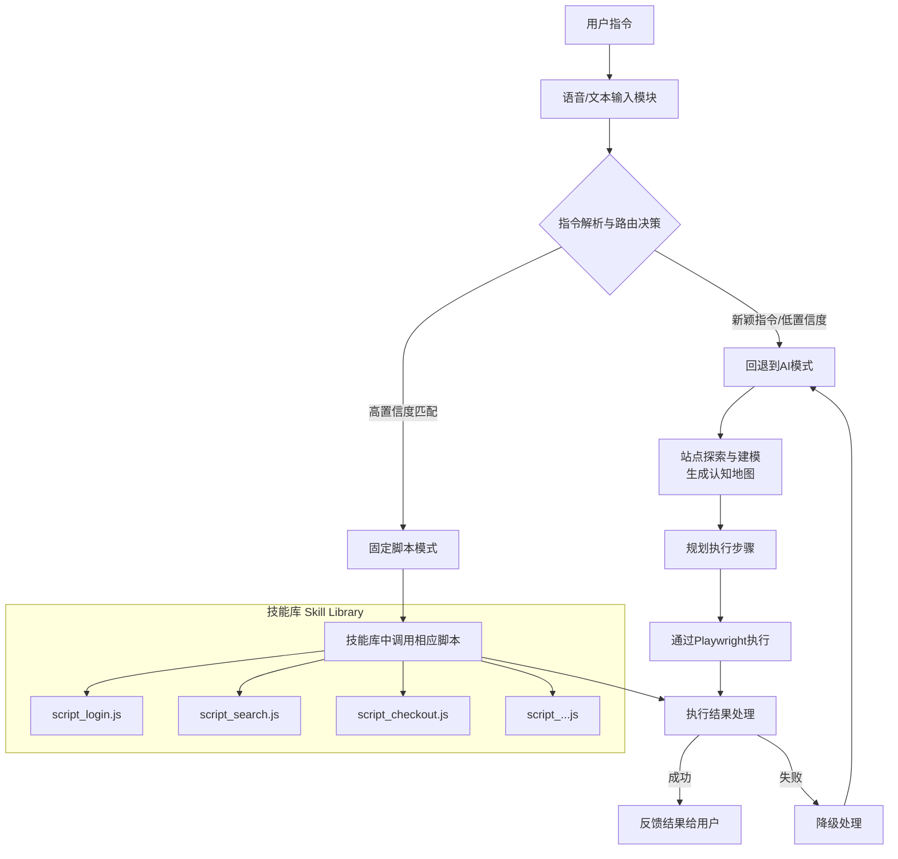
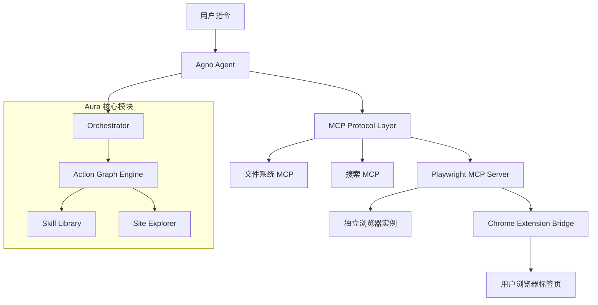

# Aura 完整解决方案

## 项目概述

### 项目愿景
构建一个通过自然语言（语音/文本）指令操作浏览器的智能系统，能够理解用户意图，在复杂网站中可靠地执行多步任务，如同一个数字助手。

### 核心价值
- **无障碍交互**：通过自然语言降低自动化操作的技术门槛
- **智能导航**：在未知或复杂网站中自主探索和定位目标
- **稳定执行**：结合AI灵活性与脚本可靠性，实现工业级稳定性
- **高效复用**：将成功操作固化为可共享的"技能"，持续积累价值

## 系统架构

本系统采用"混合智能"架构，结合AI的认知能力与脚本的执行可靠性，其完整工作流程如下：



## 架构设计说明 (ADR)

### ADR-1 混合智能架构
- **决策**：保留"AI动态规划 + 固定脚本"双模式，新增 Orchestrator、Policy Engine、Skill Library、Site Model Registry
- **动机**：提高扩展性、风险可控性和沉淀能力
- **后果**：架构更复杂，但具备可持续迭代基础

### ADR-2 Action Graph
- **决策**：AI 输出先转化为 Action Graph（DAG），再执行
- **动机**：可验证、可重放、可迁移
- **后果**：需要 Schema 和编译器，但能形成稳定执行基座

### ADR-3 技能包（Skill Pack）
- **决策**：固定脚本系统升级为 Skill Pack（Manifest + 参数Schema + 断言 + 可观测性）
- **动机**：形成标准化技能生态
- **后果**：需注册中心与沉淀流水线

### ADR-4 Site Model Registry
- **决策**：探索结果存入模型仓库（语义定位符+版本化）
- **动机**：抗选择器漂移，支持增量与回滚
- **后果**：需存储与TTL治理

### ADR-5 Policy & Risk Engine
- **决策**：高风险操作强制走策略引擎，人审/多因子
- **动机**：确保安全合规
- **后果**：可能增加交互摩擦

### ADR-6 Observability & Replay
- **决策**：执行链全量日志+截图+回放
- **动机**：调试与审计友好
- **后果**：增加存储成本

## 核心模块详解

### 语音/文本输入模块
- **语音识别**：使用Web Speech API或华为云语音服务
- **文本接口**：提供简洁的聊天式界面
- **指令队列**：支持多指令排队和优先级管理

### 指令解析与路由决策

```jsx
// 决策逻辑示例
async function decideExecutionStrategy(userCommand) {
  const analysis = await llmAnalyze(userCommand);

  // 检查是否有高置信度脚本匹配
  const scriptMatch = findScriptMatch(analysis.intent, analysis.parameters);

  if (scriptMatch && scriptMatch.confidence > 0.85) {
    return {
      mode: 'script',
      scriptId: scriptMatch.id,
      parameters: scriptMatch.parameters
    };
  } else {
    return {
      mode: 'ai_agent',
      plan: analysis.suggested_plan
    };
  }
}
```

### 站点探索与建模引擎

**探索策略**：
- 广度优先遍历发现所有主要页面
- 交互式探索（点击、悬停、输入）
- 关键元素捕获与分类

**站点模型结构**：
```json
{
  "metadata": {
    "domain": "example.com",
    "lastExplored": "2024-06-01T10:30:00Z",
    "version": "1.2"
  },
  "pages": {
    "homepage": {
      "url": "/",
      "description": "网站主页，包含主导航和搜索功能",
      "elements": {
        "searchBox": {
          "selectors": ["#searchInput", ".search-field"],
          "type": "text_input",
          "purpose": "全局搜索"
        }
      }
    }
  },
  "navigationGraph": {
    "homepage": ["searchResults", "productCategory", "loginPage"]
  }
}
```

### 固定脚本系统（升级为Skill Pack）

**Skill Pack Manifest 示例**：
```json
{
  "id": "example.search",
  "version": "1.0.0",
  "target": ["example.com"],
  "inputs": {
    "productName": {"type": "string", "required": true}
  },
  "assertions": [{ "name": "HasResults", "selector": "#results", "timeoutMs": 10000 }],
  "observability": { "captureScreenshot": "onError|onCheckpoint" },
  "examples": [{ "inputs": {"productName": "Kindle"}, "goldenOutputHash": "sha256:dummyhash" }],
  "permissions": ["readPublic"],
  "signatures": {"author": "radial", "checksum": "sha256:placeholder"}
}
```

### 执行引擎 (Playwright MCP)
- **浏览器管理**：多实例、上下文隔离
- **操作执行**：点击、输入、导航、提取等原子操作
- **状态监控**：网络活动、页面加载、元素状态
- **错误恢复**：超时处理、重试机制、异常捕获

### Action Graph 执行器
```python
from playwright.sync_api import sync_playwright

class Executor:
    def __init__(self, graph):
        self.graph = graph

    def run(self):
        with sync_playwright() as p:
            browser = p.chromium.launch(headless=False)
            page = browser.new_page()
            try:
                for node in self.graph["nodes"]:
                    if node["type"] == "navigate":
                        page.goto(node["url"])
                    elif node["type"] == "type":
                        page.fill(node["locator"], node["text"])
                    elif node["type"] == "click":
                        page.click(node["locator"])
                    elif node["type"] == "assert":
                        page.wait_for_selector(node["locator"], timeout=5000)
                print("Action Graph completed successfully!")
            finally:
                browser.close()
```

### Action Graph 示例
```json
{
  "goal": "search_product",
  "nodes": [
    {"id": "openHome", "type": "navigate", "url": "https://example.com"},
    {"id": "findSearch", "type": "locate", "locator": "input[name='q']"},
    {"id": "fill", "type": "type", "locator": "input[name='q']", "text": "Kindle"},
    {"id": "submit", "type": "click", "locator": "button[type='submit']"},
    {"id": "assertResults", "type": "assert", "locator": "#results"}
  ],
  "edges": [
    {"from": "openHome", "to": "findSearch"},
    {"from": "findSearch", "to": "fill"},
    {"from": "fill", "to": "submit"},
    {"from": "submit", "to": "assertResults"}
  ],
  "budgetTokens": 3000
}
```

### 反馈与确认系统
- **视觉反馈**：操作高亮、进度指示、结果展示
- **语音反馈**：使用TTS播报重要状态变化
- **确认机制**：高风险操作前的用户确认
- **日志系统**：详细的操作日志和审计跟踪

## 接口文档

### Orchestrator API
- `POST /jobs` → 创建任务
  ```json
  { "goal": "string", "constraints": {}, "riskLevel": "low|high", "budgetTokens": 3000, "siteScope": "domain" }
  ```
- `GET /jobs/{id}` → 查询状态
- `POST /jobs/{id}/replay` → 回放任务

### Skill Library API
- `POST /skills/publish` → 发布技能
- `GET /skills/{id}` → 查询技能详情

### Site Model Registry API
- `POST /models/update` → 提交新模型
- `GET /models/{domain}@{version}` → 获取模型

### Action Graph Schema (简化)
```json
{
  "goal": "string",
  "nodes": [
    { "id": "string", "type": "navigate|click|type|assert", "locator": "string", "text": "string" }
  ],
  "edges": [{ "from": "string", "to": "string" }],
  "budgetTokens": 3000
}
```

## 实施路线图

### 阶段一：基础框架搭建 (MVP 2-3周)
- [ ] 跑通搜索→详情任务
- [ ] ≥95% 成功率，≤2 次重试
- [ ] 日志含截图
- [ ] 无敏感数据落盘
- **技术栈配置**：设置Playwright MCP Server、Node.js环境
- **基础交互**：实现文本指令输入和简单操作（点击、导航）
- **AI集成**：配置LLM连接和基本指令解析
- **反馈机制**：实现基本的结果反馈和错误处理

### 阶段二：核心智能实现 (建模 3-4周)
- [ ] Site Model Registry v1 完成
- [ ] 语义定位符通过 UI 扰动测试
- [ ] Action Graph IR 校验 100%
- **站点探索器**：开发自动网站探索和建模功能
- **模型管理**：实现站点模型的存储、版本和查询
- **智能路由**：开发决策器，选择最佳执行策略
- **脚本系统**：设计固定脚本格式和注册机制

### 阶段三：高级功能与优化 (技能沉淀 4-5周)
- [ ] AI → Skill Pack 自动生成
- [ ] 技能灰度上线成功
- [ ] 可视化回放+对比报告
- **语音接口**：集成语音识别和TTS功能
- **性能优化**：实现并发执行、缓存和资源管理
- **用户界面**：开发浏览器扩展或独立UI
- **测试覆盖**：编写全面测试用例，覆盖主要场景

### 阶段四：生产环境部署 (生产与风控 2-3周)
- [ ] Policy Engine 上线
- [ ] Observability 全链路
- [ ] 运维手册完成
- **安全加固**：实施权限控制、输入验证和防注入
- **监控日志**：添加详细日志记录和性能监控
- **部署打包**：创建安装包和部署脚本
- **文档编写**：准备用户文档和开发文档

## 指标体系
- 成功率、重试率、延迟 P50/P95
- 人审率、Token 成本/任务
- 模型更新频率、技能转化率、回滚次数

## 潜在挑战与解决方案

### 技术挑战
1. **网站动态性**：
    - 挑战：网站结构变化导致元素选择器失效
    - 解决方案：多备用选择器、视觉定位、定期模型更新
2. **性能问题**：
    - 挑战：大规模网站探索耗时较长
    - 解决方案：增量探索、优先级队列、分布式执行
3. **跨浏览器兼容**：
    - 挑战：不同浏览器渲染和行为差异
    - 解决方案：浏览器特定适配、特性检测、降级方案

### 用户体验挑战
1. **指令歧义**：
    - 挑战：自然语言指令可能存在二义性
    - 解决方案：澄清对话、置信度显示、用户确认
2. **执行透明度**：
    - 挑战：用户不了解系统正在做什么
    - 解决方案：实时可视化、进度反馈、详细日志

### 安全与伦理挑战
1. **隐私保护**：
    - 挑战：自动化操作可能涉及敏感数据
    - 解决方案：数据本地处理、权限控制、匿名化
2. **滥用防护**：
    - 挑战：系统可能被用于恶意自动化
    - 解决方案：使用限制、伦理准则、行为监控

## 未来扩展方向

### 短期扩展
- **多模态定位**：视觉+DOM定位结合
- **技能生态插件化**：支持签名/评分机制
- **跨平台统一**：Action Graph 执行扩展到多平台

### 中长期愿景
1. **跨平台扩展**：从浏览器扩展到桌面和移动应用自动化
2. **预测性协助**：基于用户习惯预测下一步操作
3. **自适应学习**：系统能够从成功和失败中自主学习优化
4. **企业级功能**：团队管理、审计日志、合规性支持

## 项目结构

```
Aura/
├── src/                          # 源代码目录
│   ├── core/                     # 核心模块
│   │   ├── __init__.py
│   │   ├── orchestrator.py       # 主调度器
│   │   ├── action_graph.py       # Action Graph执行引擎
│   │   ├── policy_engine.py      # 策略引擎
│   │   └── risk_engine.py        # 风险评估引擎
│   ├── modules/                  # 功能模块
│   │   ├── __init__.py
│   │   ├── command_parser.py     # 指令解析器
│   │   ├── skill_library.py      # 技能库管理
│   │   └── site_explorer.py      # 站点探索引擎
│   ├── api/                      # API接口
│   │   ├── __init__.py
│   │   ├── app.py               # FastAPI应用
│   │   └── routes.py            # 路由定义
│   ├── cli/                      # 命令行界面
│   │   └── interface.py
│   ├── utils/                    # 工具模块
│   │   ├── __init__.py
│   │   ├── logger.py            # 日志系统
│   │   └── exceptions.py        # 异常定义
│   └── data/                     # 数据模块
│       └── __init__.py
├── tests/                        # 测试文件
│   ├── __init__.py
│   ├── conftest.py              # 测试配置
│   ├── test_orchestrator.py     # 调度器测试
│   ├── test_action_graph.py     # Action Graph测试
│   ├── test_command_parser.py   # 指令解析测试
│   ├── test_site_explorer.py    # 站点探索测试
│   └── test_skill_library.py    # 技能库测试
├── config/                       # 配置文件
│   ├── __init__.py
│   ├── settings.py              # 配置管理
│   ├── development.yaml         # 开发环境配置
│   ├── production.yaml          # 生产环境配置
│   ├── logging.yaml             # 日志配置
│   └── security.yaml            # 安全配置
├── skills/                       # 技能包目录
│   └── __init__.py
├── scripts/                      # 脚本文件
│   ├── dev.py                   # 开发脚本
│   ├── deploy.py                # 部署脚本
│   └── start.py                 # 启动脚本
├── logs/                         # 日志目录
├── main.py                       # 主入口文件
├── requirements.txt              # 依赖列表
├── pyproject.toml               # 项目配置
├── setup.py                     # 安装脚本
└── README.md                    # 项目文档
```

## 核心代码实现

### 1. Orchestrator 核心调度器

```python
# src/core/orchestrator.py
import asyncio
import uuid
from datetime import datetime
from enum import Enum
from typing import Dict, List, Optional, Any
from dataclasses import dataclass, field

class TaskStatus(Enum):
    """任务状态枚举"""
    PENDING = "pending"
    RUNNING = "running"
    COMPLETED = "completed"
    FAILED = "failed"
    CANCELLED = "cancelled"

class ExecutionMode(Enum):
    """执行模式枚举"""
    SCRIPT = "script"      # 固定脚本模式
    AI_AGENT = "ai_agent"  # AI动态规划模式
    HYBRID = "hybrid"      # 混合模式

@dataclass
class TaskRequest:
    """任务请求数据结构"""
    goal: str
    constraints: Dict[str, Any] = field(default_factory=dict)
    risk_level: str = "low"
    budget_tokens: int = 3000
    site_scope: Optional[str] = None
    execution_mode: Optional[ExecutionMode] = None

@dataclass
class TaskResult:
    """任务结果数据结构"""
    task_id: str
    status: TaskStatus
    goal: str
    start_time: datetime
    end_time: Optional[datetime] = None
    result_data: Optional[Dict[str, Any]] = None
    error_message: Optional[str] = None
    execution_log: List[Dict[str, Any]] = field(default_factory=list)

class Orchestrator:
    """核心调度器"""
    
    def __init__(self):
        self.tasks: Dict[str, TaskResult] = {}
        self.command_parser = CommandParser()
        self.skill_library = SkillLibrary()
        self.site_explorer = SiteExplorer()
        self.policy_engine = PolicyEngine()
        self.risk_engine = RiskEngine()
        self.action_graph_executor = ActionGraphEngine()
    
    async def create_job(self, request: TaskRequest) -> str:
        """创建新任务"""
        task_id = str(uuid.uuid4())
        
        # 创建任务记录
        task_result = TaskResult(
            task_id=task_id,
            status=TaskStatus.PENDING,
            goal=request.goal,
            start_time=datetime.now()
        )
        self.tasks[task_id] = task_result
        
        # 异步执行任务
        asyncio.create_task(self._execute_task(task_id, request))
        
        return task_id
    
    async def _execute_task(self, task_id: str, request: TaskRequest):
        """执行任务"""
        try:
            task = self.tasks[task_id]
            task.status = TaskStatus.RUNNING
            
            # 1. 解析用户指令
            parsed_command = await self.command_parser.parse_command(request.goal)
            
            # 2. 决定执行策略
            execution_mode = await self._decide_execution_strategy(
                parsed_command, request
            )
            
            # 3. 执行任务
            result = await self._execute_strategy(
                execution_mode, parsed_command, request
            )
            
            # 4. 更新任务状态
            task.status = TaskStatus.COMPLETED
            task.result_data = result
            task.end_time = datetime.now()
            
        except Exception as e:
            task.status = TaskStatus.FAILED
            task.error_message = str(e)
            task.end_time = datetime.now()
    
    async def _decide_execution_strategy(self, parsed_command, request) -> ExecutionMode:
        """决定执行策略"""
        # 检查技能库中是否有匹配的技能
        matching_skills = await self.skill_library.find_matching_skills(
            parsed_command['intent'], 
            parsed_command['parameters']
        )
        
        if matching_skills and matching_skills[0]['confidence'] > 0.85:
            return ExecutionMode.SCRIPT
        else:
            return ExecutionMode.AI_AGENT
    
    async def _execute_strategy(self, mode: ExecutionMode, parsed_command, request):
        """根据策略执行任务"""
        if mode == ExecutionMode.SCRIPT:
            return await self._execute_script_mode(parsed_command, request)
        elif mode == ExecutionMode.AI_AGENT:
            return await self._execute_ai_agent_mode(parsed_command, request)
        else:
            raise ValueError(f"Unsupported execution mode: {mode}")
```

### 2. Action Graph 执行引擎

```python
# src/core/action_graph.py
import json
import time
import uuid
from dataclasses import dataclass, field
from enum import Enum
from typing import Dict, List, Optional, Any
from datetime import datetime

class NodeType(Enum):
    """Action Graph节点类型"""
    NAVIGATE = "navigate"
    CLICK = "click"
    TYPE = "type"
    ASSERT = "assert"
    WAIT = "wait"
    EXTRACT = "extract"
    SCROLL = "scroll"
    HOVER = "hover"
    SELECT = "select"
    SCREENSHOT = "screenshot"

class NodeStatus(Enum):
    """节点执行状态"""
    PENDING = "pending"
    RUNNING = "running"
    COMPLETED = "completed"
    FAILED = "failed"
    SKIPPED = "skipped"

@dataclass
class ActionNode:
    """Action Graph节点"""
    id: str
    type: NodeType
    locator: Optional[str] = None
    text: Optional[str] = None
    url: Optional[str] = None
    timeout: int = 5000
    retry_count: int = 3
    description: Optional[str] = None
    metadata: Dict[str, Any] = field(default_factory=dict)
    
    # 执行状态
    status: NodeStatus = NodeStatus.PENDING
    start_time: Optional[datetime] = None
    end_time: Optional[datetime] = None
    error_message: Optional[str] = None
    result: Optional[Any] = None

@dataclass
class ActionGraph:
    """Action Graph数据结构"""
    id: str
    goal: str
    nodes: List[ActionNode]
    edges: List[Dict[str, str]]
    budget_tokens: int = 3000
    timeout: int = 60000
    metadata: Dict[str, Any] = field(default_factory=dict)

class ActionGraphEngine:
    """Action Graph执行引擎"""
    
    def __init__(self):
        self._browser = None
        self._page = None
    
    async def execute_graph(self, graph: ActionGraph) -> Dict[str, Any]:
        """执行Action Graph"""
        try:
            # 初始化浏览器
            await self._init_browser()
            
            # 按拓扑顺序执行节点
            execution_order = self._get_execution_order(graph)
            
            for node_id in execution_order:
                node = self._find_node(graph, node_id)
                await self._execute_node(node)
            
            return {
                "status": "success",
                "results": [node.result for node in graph.nodes]
            }
            
        except Exception as e:
            return {
                "status": "failed",
                "error": str(e)
            }
        finally:
            await self._cleanup_browser()
    
    async def _execute_node(self, node: ActionNode):
        """执行单个节点"""
        node.status = NodeStatus.RUNNING
        node.start_time = datetime.now()
        
        try:
            if node.type == NodeType.NAVIGATE:
                await self._page.goto(node.url)
            elif node.type == NodeType.CLICK:
                await self._page.click(node.locator)
            elif node.type == NodeType.TYPE:
                await self._page.fill(node.locator, node.text)
            elif node.type == NodeType.ASSERT:
                await self._page.wait_for_selector(node.locator, timeout=node.timeout)
            # ... 其他节点类型的实现
            
            node.status = NodeStatus.COMPLETED
            
        except Exception as e:
            node.status = NodeStatus.FAILED
            node.error_message = str(e)
            raise
        finally:
            node.end_time = datetime.now()
```

### 3. 技能库管理系统

```python
# src/modules/skill_library.py
import json
import os
from typing import Dict, List, Optional, Any
from dataclasses import dataclass, field
from enum import Enum

class SkillType(Enum):
    """技能类型"""
    NAVIGATION = "navigation"
    FORM_FILLING = "form_filling"
    DATA_EXTRACTION = "data_extraction"
    INTERACTION = "interaction"
    VERIFICATION = "verification"

@dataclass
class SkillInput:
    """技能输入参数"""
    name: str
    type: str
    required: bool = True
    description: Optional[str] = None
    default_value: Optional[Any] = None

@dataclass
class SkillOutput:
    """技能输出结果"""
    name: str
    type: str
    description: Optional[str] = None

@dataclass
class SkillAssertion:
    """技能断言"""
    name: str
    selector: str
    timeout_ms: int = 10000
    description: Optional[str] = None

@dataclass
class SkillManifest:
    """技能清单"""
    id: str
    version: str
    name: str
    description: str
    skill_type: SkillType
    target_domains: List[str]
    inputs: List[SkillInput]
    outputs: List[SkillOutput]
    assertions: List[SkillAssertion]
    tags: List[str] = field(default_factory=list)
    author: Optional[str] = None
    created_at: Optional[str] = None
    updated_at: Optional[str] = None

class SkillLibrary:
    """技能库管理系统"""
    
    def __init__(self, skills_dir: str = "skills"):
        self.skills_dir = skills_dir
        self.skills: Dict[str, SkillManifest] = {}
        self._load_skills()
    
    def _load_skills(self):
        """加载技能包"""
        if not os.path.exists(self.skills_dir):
            os.makedirs(self.skills_dir)
            return
        
        for skill_dir in os.listdir(self.skills_dir):
            skill_path = os.path.join(self.skills_dir, skill_dir)
            if os.path.isdir(skill_path):
                manifest_path = os.path.join(skill_path, "manifest.json")
                if os.path.exists(manifest_path):
                    with open(manifest_path, 'r', encoding='utf-8') as f:
                        manifest_data = json.load(f)
                        skill = self._parse_manifest(manifest_data)
                        self.skills[skill.id] = skill
    
    async def find_matching_skills(self, intent: str, parameters: Dict[str, Any]) -> List[Dict[str, Any]]:
        """查找匹配的技能"""
        matches = []
        intent_lower = intent.lower()
        
        for skill_id, skill in self.skills.items():
            confidence = 0.0
            
            # 基于名称匹配
            if intent_lower in skill.name.lower():
                confidence += 0.4
            
            # 基于描述匹配
            if intent_lower in skill.description.lower():
                confidence += 0.3
            
            # 基于标签匹配
            for tag in skill.tags:
                if intent_lower in tag.lower():
                    confidence += 0.2
                    break
            
            if confidence > 0:
                matches.append({
                    "skill_id": skill_id,
                    "confidence": confidence,
                    "parameters": parameters
                })
        
        # 按置信度排序
        matches.sort(key=lambda x: x["confidence"], reverse=True)
        return matches
    
    async def execute_skill(self, skill_id: str, parameters: Dict[str, Any]) -> Dict[str, Any]:
        """执行技能"""
        if skill_id not in self.skills:
            raise ValueError(f"Skill not found: {skill_id}")
        
        skill = self.skills[skill_id]
        
        # 验证输入参数
        self._validate_inputs(skill, parameters)
        
        # 检查权限
        self._check_permissions(skill, parameters)
        
        # 执行技能脚本
        return await self._execute_skill_script(skill, parameters)
```

### 4. 站点探索引擎

```python
# src/modules/site_explorer.py
import asyncio
from dataclasses import dataclass, field
from enum import Enum
from typing import Dict, List, Optional, Any, Set
from datetime import datetime

class ExplorationStrategy(Enum):
    """探索策略"""
    BREADTH_FIRST = "breadth_first"
    DEPTH_FIRST = "depth_first"
    INTERACTIVE = "interactive"
    TARGETED = "targeted"

class ElementType(Enum):
    """元素类型"""
    BUTTON = "button"
    LINK = "link"
    INPUT = "input"
    FORM = "form"
    NAVIGATION = "navigation"
    CONTENT = "content"

class PageType(Enum):
    """页面类型"""
    HOMEPAGE = "homepage"
    SEARCH_RESULTS = "search_results"
    PRODUCT_DETAIL = "product_detail"
    LOGIN = "login"
    CHECKOUT = "checkout"
    CATEGORY = "category"

@dataclass
class ElementInfo:
    """元素信息"""
    selector: str
    element_type: ElementType
    text: Optional[str] = None
    attributes: Dict[str, str] = field(default_factory=dict)
    purpose: Optional[str] = None

@dataclass
class PageInfo:
    """页面信息"""
    url: str
    title: str
    page_type: PageType
    elements: Dict[str, ElementInfo] = field(default_factory=dict)
    description: Optional[str] = None
    last_explored: Optional[datetime] = None

@dataclass
class SiteModel:
    """站点模型"""
    domain: str
    pages: Dict[str, PageInfo] = field(default_factory=dict)
    navigation_graph: Dict[str, List[str]] = field(default_factory=dict)
    metadata: Dict[str, Any] = field(default_factory=dict)
    version: str = "1.0"
    created_at: Optional[datetime] = None
    updated_at: Optional[datetime] = None

class SiteExplorer:
    """站点探索引擎"""
    
    def __init__(self):
        self.site_models: Dict[str, SiteModel] = {}
        self.exploration_queue: List[str] = []
        self.visited_urls: Set[str] = set()
        self.running_tasks: Dict[str, asyncio.Task] = {}
    
    async def explore_site(self, domain: str, start_url: str, 
                          strategy: ExplorationStrategy = ExplorationStrategy.BREADTH_FIRST,
                          max_depth: int = 3) -> SiteModel:
        """探索站点"""
        # 创建或获取站点模型
        if domain not in self.site_models:
            self.site_models[domain] = SiteModel(
                domain=domain,
                created_at=datetime.now()
            )
        
        site_model = self.site_models[domain]
        
        # 根据策略执行探索
        if strategy == ExplorationStrategy.BREADTH_FIRST:
            await self._explore_breadth_first(site_model, start_url, max_depth)
        elif strategy == ExplorationStrategy.DEPTH_FIRST:
            await self._explore_depth_first(site_model, start_url, max_depth)
        elif strategy == ExplorationStrategy.INTERACTIVE:
            await self._explore_interactive(site_model, start_url, max_depth)
        elif strategy == ExplorationStrategy.TARGETED:
            await self._explore_targeted(site_model, start_url, max_depth)
        
        site_model.updated_at = datetime.now()
        return site_model
    
    async def explore_and_model(self, domain: str, start_url: str, 
                               strategy: ExplorationStrategy, max_depth: int) -> SiteModel:
        """探索并建模站点"""
        return await self.explore_site(domain, start_url, strategy, max_depth)
```

### 5. 指令解析器

```python
# src/modules/command_parser.py
import re
from typing import Dict, List, Optional, Any
from dataclasses import dataclass
from enum import Enum

class IntentType(Enum):
    """意图类型"""
    SEARCH = "search"
    NAVIGATE = "navigate"
    FILL_FORM = "fill_form"
    CLICK = "click"
    EXTRACT = "extract"
    LOGIN = "login"
    PURCHASE = "purchase"
    UNKNOWN = "unknown"

@dataclass
class ParsedCommand:
    """解析后的指令"""
    intent: IntentType
    parameters: Dict[str, Any]
    confidence: float
    raw_command: str
    entities: List[Dict[str, Any]]

class CommandParser:
    """指令解析器"""
    
    def __init__(self):
        self.intent_patterns = {
            IntentType.SEARCH: [
                r"搜索\s*(.+)",
                r"查找\s*(.+)",
                r"search\s+for\s+(.+)",
                r"find\s+(.+)"
            ],
            IntentType.NAVIGATE: [
                r"打开\s*(.+)",
                r"访问\s*(.+)",
                r"go\s+to\s+(.+)",
                r"navigate\s+to\s+(.+)"
            ],
            IntentType.LOGIN: [
                r"登录",
                r"登陆",
                r"login",
                r"sign\s+in"
            ]
        }
    
    async def parse_command(self, command: str) -> ParsedCommand:
        """解析用户指令"""
        command = command.strip()
        
        # 意图识别
        intent, confidence, parameters = self._identify_intent(command)
        
        # 实体提取
        entities = self._extract_entities(command)
        
        return ParsedCommand(
            intent=intent,
            parameters=parameters,
            confidence=confidence,
            raw_command=command,
            entities=entities
        )
    
    def _identify_intent(self, command: str) -> tuple:
        """识别意图"""
        command_lower = command.lower()
        best_match = (IntentType.UNKNOWN, 0.0, {})
        
        for intent_type, patterns in self.intent_patterns.items():
            for pattern in patterns:
                match = re.search(pattern, command_lower)
                if match:
                    confidence = 0.8  # 基础置信度
                    parameters = {}
                    
                    # 提取参数
                    if match.groups():
                        parameters['target'] = match.group(1).strip()
                    
                    if confidence > best_match[1]:
                        best_match = (intent_type, confidence, parameters)
        
        return best_match
    
    def _extract_entities(self, command: str) -> List[Dict[str, Any]]:
        """提取实体"""
        entities = []
        
        # URL实体
        url_pattern = r'https?://[^\s]+'
        urls = re.findall(url_pattern, command)
        for url in urls:
            entities.append({
                'type': 'url',
                'value': url,
                'start': command.find(url),
                'end': command.find(url) + len(url)
            })
        
        # 邮箱实体
        email_pattern = r'\b[A-Za-z0-9._%+-]+@[A-Za-z0-9.-]+\.[A-Z|a-z]{2,}\b'
        emails = re.findall(email_pattern, command)
        for email in emails:
            entities.append({
                'type': 'email',
                'value': email,
                'start': command.find(email),
                'end': command.find(email) + len(email)
            })
        
        return entities
```

## 技术依赖与集成

### Agno MCP 集成

Aura 项目核心依赖 [Agno](https://docs.agno.com/tools/mcp/mcp) 的 Model Context Protocol (MCP) 技术栈，实现智能代理与外部系统的标准化交互。 <mcreference link="https://docs.agno.com/tools/mcp/mcp" index="1">1</mcreference>

#### 核心特性
- **标准化接口**：通过 MCP 协议实现代理与浏览器自动化工具的无缝集成 <mcreference link="https://docs.agno.com/tools/mcp/mcp" index="1">1</mcreference>
- **多服务器支持**：可同时连接多个 MCP 服务器，实现复合功能 <mcreference link="https://docs.agno.com/tools/mcp/advanced_usage" index="3">3</mcreference>
- **异步架构**：支持高并发的浏览器操作和任务执行
- **资源管理**：自动处理连接生命周期和资源清理 <mcreference link="https://docs.agno.com/tools/mcp/mcp" index="1">1</mcreference>

#### 集成示例
```python
from agno.agent import Agent
from agno.models.openai import OpenAIChat
from agno.tools.mcp import MCPTools, MultiMCPTools

# 单一 MCP 服务器连接
async def create_aura_agent():
    mcp_tools = MCPTools("npx @playwright/mcp@latest --extension")
    await mcp_tools.connect()
    
    agent = Agent(
        model=OpenAIChat(id="gpt-4o"),
        tools=[mcp_tools],
        instructions="""
        你是 Aura 智能浏览器助手。能够：
        - 理解用户的自然语言指令
        - 在复杂网站中导航和操作
        - 执行多步骤任务流程
        - 学习和复用成功的操作模式
        """,
        markdown=True,
        show_tool_calls=True
    )
    
    return agent, mcp_tools

# 多服务器集成（浏览器 + 文件系统 + 其他工具）
async def create_enhanced_agent():
    mcp_tools = MultiMCPTools([
        "npx @playwright/mcp@latest --extension",
        "npx -y @modelcontextprotocol/server-filesystem .",
        "npx -y @modelcontextprotocol/server-brave-search"
    ])
    await mcp_tools.connect()
    
    return Agent(
        model=OpenAIChat(id="gpt-4o"),
        tools=[mcp_tools],
        instructions="增强版 Aura 助手，具备浏览器操作、文件管理和网络搜索能力"
    )
```

### Playwright MCP 浏览器扩展

项目集成 [Microsoft Playwright MCP](https://github.com/microsoft/playwright-mcp) 实现浏览器自动化，特别是其 **Chrome Extension** 功能。 <mcreference link="https://github.com/microsoft/playwright-mcp" index="2">2</mcreference>

#### 浏览器扩展核心优势
- **现有会话复用**：连接到用户已登录的浏览器标签页，保持认证状态 <mcreference link="https://github.com/microsoft/playwright-mcp/blob/main/extension/README.md" index="1">1</mcreference> <mcreference link="https://dev.to/debs_obrien/testing-in-a-logged-in-state-with-the-playwright-mcp-browser-extension-4cmg" index="5">5</mcreference>
- **真实用户环境**：利用用户的默认浏览器配置文件和扩展 <mcreference link="https://github.com/microsoft/playwright-mcp/blob/main/extension/README.md" index="4">4</mcreference>
- **无需重复登录**：直接在已认证的企业应用中执行操作 <mcreference link="https://dev.to/debs_obrien/testing-in-a-logged-in-state-with-the-playwright-mcp-browser-extension-4cmg" index="5">5</mcreference>
- **跨平台支持**：兼容 Chrome、Edge 和其他 Chromium 浏览器 <mcreference link="https://dev.to/debs_obrien/testing-in-a-logged-in-state-with-playwright-mcp-browser-extension-4cmg" index="5">5</mcreference>

#### 配置示例
```json
{
  "mcpServers": {
    "playwright-extension": {
      "command": "npx",
      "args": [
        "@playwright/mcp@latest",
        "--extension"
      ]
    }
  }
}
```

#### 扩展安装与设置
1. **安装 Playwright MCP Bridge 扩展**：在 Chrome/Edge 扩展商店安装 <mcreference link="https://github.com/microsoft/playwright-mcp" index="2">2</mcreference>
2. **配置 MCP 服务器**：使用 `--extension` 参数启动 <mcreference link="https://github.com/microsoft/playwright-mcp/blob/main/extension/README.md" index="4">4</mcreference>
3. **标签页选择**：首次交互时选择要连接的浏览器标签页 <mcreference link="https://github.com/microsoft/playwright-mcp/blob/main/extension/README.md" index="1">1</mcreference>

### 技术架构集成



## 实现规划

### Phase 1: MCP 基础集成 (Week 1-2)

#### 1.1 环境搭建
- [ ] 安装 Agno 框架：`pip install agno`
- [ ] 配置 Playwright MCP：`npm install -g @playwright/mcp`
- [ ] 安装浏览器扩展：Playwright MCP Bridge
- [ ] 设置开发环境和测试配置

#### 1.2 基础 MCP 连接
```python
# src/core/mcp_manager.py
class MCPManager:
    """MCP 连接管理器"""
    
    def __init__(self):
        self.playwright_mcp = None
        self.filesystem_mcp = None
        self.multi_mcp = None
    
    async def initialize_playwright_extension(self):
        """初始化 Playwright 扩展模式"""
        self.playwright_mcp = MCPTools(
            "npx @playwright/mcp@latest --extension"
        )
        await self.playwright_mcp.connect()
    
    async def initialize_multi_mcp(self):
        """初始化多服务器模式"""
        self.multi_mcp = MultiMCPTools([
            "npx @playwright/mcp@latest --extension",
            "npx -y @modelcontextprotocol/server-filesystem ."
        ])
        await self.multi_mcp.connect()
```

#### 1.3 Orchestrator MCP 集成
```python
# 更新 src/core/orchestrator.py
class Orchestrator:
    def __init__(self):
        self.mcp_manager = MCPManager()
        self.agent = None
    
    async def initialize(self):
        """初始化 MCP 连接和 Agent"""
        await self.mcp_manager.initialize_playwright_extension()
        
        self.agent = Agent(
            model=OpenAIChat(id="gpt-4o"),
            tools=[self.mcp_manager.playwright_mcp],
            instructions=self._get_aura_instructions()
        )
    
    async def execute_command(self, command: str):
        """执行用户指令"""
        return await self.agent.aprint_response(command, stream=True)
```

### Phase 2: 浏览器扩展深度集成 (Week 3-4)

#### 2.1 扩展模式优化
- [ ] 实现标签页智能选择逻辑
- [ ] 添加会话状态检测和恢复
- [ ] 优化扩展连接的错误处理

#### 2.2 Site Explorer 增强
```python
# src/modules/site_explorer.py 增强
class SiteExplorer:
    def __init__(self, mcp_tools):
        self.mcp_tools = mcp_tools
    
    async def explore_with_extension(self, url: str):
        """使用扩展模式探索网站"""
        # 利用已登录状态探索
        await self.mcp_tools.navigate(url)
        
        # 获取页面结构
        snapshot = await self.mcp_tools.take_snapshot()
        
        # 分析认证状态
        auth_status = await self._detect_auth_status()
        
        return SiteModel(
            url=url,
            structure=snapshot,
            auth_required=not auth_status,
            exploration_timestamp=datetime.now()
        )
```

### Phase 3: 技能库 MCP 适配 (Week 5-6)

#### 3.1 技能执行引擎
```python
# src/modules/skill_library.py 适配
class SkillLibrary:
    def __init__(self, mcp_manager):
        self.mcp_manager = mcp_manager
    
    async def execute_skill_with_mcp(self, skill_pack: SkillPack):
        """使用 MCP 执行技能包"""
        # 选择合适的 MCP 工具
        tools = await self._select_mcp_tools(skill_pack.requirements)
        
        # 创建专用 Agent
        skill_agent = Agent(
            model=OpenAIChat(id="gpt-4o"),
            tools=tools,
            instructions=skill_pack.instructions
        )
        
        # 执行技能
        return await skill_agent.aprint_response(
            skill_pack.action_sequence
        )
```

### Phase 4: 高级功能实现 (Week 7-8)

#### 4.1 多模态交互
- [ ] 集成语音识别 MCP 服务器
- [ ] 添加图像理解能力
- [ ] 实现屏幕截图分析

#### 4.2 企业级功能
- [ ] 多用户会话管理
- [ ] 权限控制和审计日志
- [ ] 技能包市场和分享机制

#### 4.3 性能优化
- [ ] MCP 连接池管理
- [ ] 异步任务队列
- [ ] 缓存和状态持久化

### 关键技术决策

1. **扩展优先策略**：优先使用浏览器扩展模式，降级到独立实例
2. **会话保持**：充分利用用户已登录状态，减少重复认证
3. **错误恢复**：MCP 连接失败时的自动重连和降级机制
4. **资源管理**：严格的连接生命周期管理，防止资源泄漏

## 多 MCP 服务器集成

### 支持的 MCP 服务器类型

Aura 系统支持多种 MCP 服务器的协同工作：

#### 1. Playwright MCP Server (浏览器自动化)
- **功能**：网页导航、元素交互、截图、表单填写
- **配置**：自动配置，支持扩展模式和独立模式
- **用途**：核心浏览器操作，网站探索和任务执行

#### 2. Filesystem MCP Server (文件系统操作)
- **功能**：文件读写、目录管理、文件搜索
- **配置**：需要指定工作目录路径
- **用途**：日志记录、配置管理、数据持久化

#### 3. Brave Search MCP Server (网络搜索)
- **功能**：网络搜索、信息检索、内容分析
- **配置**：需要 Brave Search API 密钥
- **用途**：信息收集、网站发现、内容验证

#### 4. Memory MCP Server (内存存储)
- **功能**：键值存储、会话状态管理、临时数据缓存
- **配置**：自动配置，无需额外设置
- **用途**：状态保持、数据共享、工作流协调

### MCP 配置管理

#### 使用配置管理工具

```bash
# 查看所有服务器状态
python tools/mcp_config_manager.py list

# 启用特定服务器
python tools/mcp_config_manager.py enable playwright
python tools/mcp_config_manager.py enable memory

# 配置文件系统服务器
python tools/mcp_config_manager.py add filesystem filesystem "npx" "@modelcontextprotocol/server-filesystem" "--workspace" "/path/to/workspace"

# 配置搜索服务器
python tools/mcp_config_manager.py add brave_search brave_search "npx" "@modelcontextprotocol/server-brave-search" "--api-key" "YOUR_API_KEY"

# 测试服务器连接
python tools/mcp_config_manager.py test playwright
python tools/mcp_config_manager.py test  # 测试所有启用的服务器

# 快速设置向导
python tools/mcp_config_manager.py quick-setup
```

#### 编程方式配置

```python
from config.mcp_config import MCPConfig
from core.mcp_manager import MCPManager

# 创建配置
config = MCPConfig()

# 启用基础服务器
config.enable_server("playwright")
config.enable_server("memory")

# 配置文件系统服务器
config.enable_filesystem_server("/path/to/workspace")

# 配置搜索服务器
config.enable_search_server("your_brave_api_key")

# 创建 MCP 管理器
mcp_manager = MCPManager(config)
await mcp_manager.initialize()
```

### 集成工作流示例

#### 1. 网站研究工作流

```python
async def research_website_workflow(url: str, search_query: str):
    """综合网站研究工作流"""
    
    # 1. 使用搜索服务器收集背景信息
    search_results = await mcp_manager.execute_command(
        "brave_search",
        {"query": search_query, "count": 5}
    )
    
    # 2. 将搜索结果存储到内存
    await mcp_manager.execute_command(
        "memory_store",
        {"key": f"research_{url}", "value": json.dumps(search_results)}
    )
    
    # 3. 使用浏览器访问目标网站
    await mcp_manager.execute_command(
        "browser_navigate",
        {"url": url}
    )
    
    # 4. 获取网站快照
    snapshot = await mcp_manager.execute_command(
        "browser_snapshot",
        {}
    )
    
    # 5. 将分析结果保存到文件
    report = {
        "url": url,
        "search_results": search_results,
        "site_structure": snapshot,
        "timestamp": datetime.now().isoformat()
    }
    
    await mcp_manager.execute_command(
        "write_file",
        {
            "path": f"reports/site_analysis_{url.replace('/', '_')}.json",
            "content": json.dumps(report, indent=2)
        }
    )
    
    return report
```

#### 2. 自动化任务执行工作流

```python
async def automated_task_workflow(task_config: dict):
    """自动化任务执行工作流"""
    
    task_id = task_config["id"]
    
    # 1. 记录任务开始状态
    await mcp_manager.execute_command(
        "memory_store",
        {
            "key": f"task_status_{task_id}",
            "value": json.dumps({"status": "started", "timestamp": datetime.now().isoformat()})
        }
    )
    
    try:
        # 2. 执行浏览器操作
        for step in task_config["steps"]:
            if step["type"] == "navigate":
                await mcp_manager.execute_command(
                    "browser_navigate",
                    {"url": step["url"]}
                )
            elif step["type"] == "click":
                await mcp_manager.execute_command(
                    "browser_click",
                    {"element": step["element"], "ref": step["ref"]}
                )
            elif step["type"] == "type":
                await mcp_manager.execute_command(
                    "browser_type",
                    {"element": step["element"], "ref": step["ref"], "text": step["text"]}
                )
                
            # 记录步骤完成
            await mcp_manager.execute_command(
                "memory_store",
                {
                    "key": f"task_step_{task_id}_{step['id']}",
                    "value": json.dumps({"status": "completed", "timestamp": datetime.now().isoformat()})
                }
            )
            
        # 3. 记录任务完成
        await mcp_manager.execute_command(
            "memory_store",
            {
                "key": f"task_status_{task_id}",
                "value": json.dumps({"status": "completed", "timestamp": datetime.now().isoformat()})
            }
        )
        
        # 4. 生成执行报告
        report_path = f"logs/task_execution_{task_id}.log"
        await mcp_manager.execute_command(
            "write_file",
            {
                "path": report_path,
                "content": f"Task {task_id} completed successfully at {datetime.now()}\n"
            }
        )
        
        return {"success": True, "report_path": report_path}
        
    except Exception as e:
        # 记录错误状态
        await mcp_manager.execute_command(
            "memory_store",
            {
                "key": f"task_status_{task_id}",
                "value": json.dumps({"status": "failed", "error": str(e), "timestamp": datetime.now().isoformat()})
            }
        )
        
        return {"success": False, "error": str(e)}
```

### 健康检查和监控

```python
# 检查所有服务器状态
status = await mcp_manager.get_server_status()
print(f"Server Status: {status}")

# 获取可用工具列表
tools = await mcp_manager.get_available_tools()
print(f"Available Tools: {len(tools)}")

# 获取特定服务器的工具
playwright_tools = await mcp_manager.get_server_tools("playwright")
print(f"Playwright Tools: {playwright_tools}")

# 重连失败的服务器
await mcp_manager.reconnect_server("playwright")
```

###### 错误处理和自动重连

Aura 系统实现了强大的错误处理和自动重连机制，确保 MCP 连接的稳定性和可靠性。

#### 核心特性

- **智能错误分类**：自动识别网络、超时、认证等不同类型的错误
- **熔断器模式**：防止级联故障，保护系统稳定性
- **指数退避重试**：智能重试机制，避免资源浪费
- **连接池管理**：高效管理多个 MCP 连接
- **健康检查**：持续监控服务器状态，及时发现问题
- **自动恢复**：检测到故障后自动尝试重连

#### 错误处理配置

```python
from src.core.mcp_error_handler import CircuitBreakerConfig, RetryConfig

# 配置熔断器
circuit_config = CircuitBreakerConfig(
    failure_threshold=5,      # 失败阈值
    recovery_timeout=30.0,    # 恢复超时时间（秒）
    half_open_max_calls=3     # 半开状态最大调用次数
)

# 配置重试策略
retry_config = RetryConfig(
    max_retries=3,           # 最大重试次数
    base_delay=1.0,          # 基础延迟时间（秒）
    max_delay=60.0,          # 最大延迟时间（秒）
    exponential_base=2.0     # 指数退避基数
)

# 应用配置到 MCP Manager
mcp_manager = MCPManager()
# 配置会在初始化时自动应用
```

#### 连接状态监控

```python
# 获取所有服务器的连接状态
connection_states = mcp_manager.get_connection_states()
for server_name, state in connection_states.items():
    print(f"{server_name}: {state.value}")
    # 可能的状态：DISCONNECTED, CONNECTING, CONNECTED, RECONNECTING

# 获取健康指标
health_metrics = mcp_manager.get_health_metrics()
print(f"总服务器数: {health_metrics['total_servers']}")
print(f"已连接服务器: {health_metrics['connected_servers']}")
print(f"重连中服务器: {health_metrics['reconnecting_servers']}")
print(f"平均失败次数: {health_metrics['average_failure_count']}")
```

#### 错误统计和分析

```python
# 获取错误统计信息
error_stats = mcp_manager.get_error_statistics()
for server_name, stats in error_stats.items():
    print(f"\n{server_name}:")
    print(f"  总错误数: {stats['total_errors']}")
    print(f"  错误率: {stats['error_rate']:.2f} 错误/分钟")
    print(f"  错误类型分布:")
    for error_type, count in stats['error_types'].items():
        print(f"    {error_type}: {count}")
```

#### 连接诊断

```python
# 运行连接诊断
diagnostics = mcp_manager.diagnose_connection_issues()
for server_name, diagnosis in diagnostics.items():
    print(f"\n{server_name}:")
    print(f"  状态: {diagnosis['status']}")
    print(f"  连接状态: {diagnosis['connection_state']}")
    print(f"  失败次数: {diagnosis['failure_count']}")
    
    if diagnosis['issues']:
        print(f"  问题: {', '.join(diagnosis['issues'])}")
    
    if diagnosis['recommendations']:
        print(f"  建议: {', '.join(diagnosis['recommendations'])}")
```

#### 手动重连操作

```python
# 重连特定服务器
await mcp_manager.reconnect_server("playwright")

# 重连所有失败的服务器
for server_name, state in mcp_manager.get_connection_states().items():
    if state != ConnectionState.CONNECTED:
        await mcp_manager.reconnect_server(server_name)
```

#### 监控工具

使用内置的监控工具进行实时监控：

```bash
# 启动实时监控
python tools/mcp_monitor.py --monitor

# 运行连接测试
python tools/mcp_monitor.py --test-connections

# 导出监控数据
python tools/mcp_monitor.py --export metrics.json

# 运行诊断
python tools/mcp_monitor.py --diagnose
```

#### 故障排除指南

**常见问题及解决方案：**

1. **连接超时**
   - 检查服务器是否正在运行
   - 验证网络连接
   - 调整超时配置

2. **认证失败**
   - 检查 API 密钥或凭据
   - 验证权限设置
   - 更新过期的认证信息

3. **频繁重连**
   - 检查网络稳定性
   - 调整健康检查间隔
   - 优化重试策略

4. **熔断器触发**
   - 分析错误日志
   - 检查服务器负载
   - 调整熔断器阈值

### 测试和验证

运行集成测试以验证多 MCP 服务器的协同工作：

```bash
# 运行完整的集成测试
python tests/test_multi_mcp_integration.py

# 运行错误处理测试
python tests/test_mcp_error_handling.py

# 运行错误处理演示
python examples/error_handling_demo.py
```

# 设置环境变量以启用特定测试
export BRAVE_API_KEY="your_api_key"
export ENABLE_BROWSER_TESTS="true"
python tests/test_multi_mcp_integration.py
```

### 故障排除

#### 常见问题

1. **服务器连接失败**
   - 检查服务器配置是否正确
   - 验证依赖包是否已安装
   - 查看日志文件获取详细错误信息

2. **权限问题**
   - 确保文件系统服务器有适当的目录访问权限
   - 检查 API 密钥是否有效

3. **性能问题**
   - 监控服务器资源使用情况
   - 调整超时和重试配置
   - 考虑启用连接池

#### 调试技巧

```python
# 启用详细日志
import logging
logging.basicConfig(level=logging.DEBUG)

# 检查特定服务器的详细状态
server_details = await mcp_manager.get_server_details("playwright")
print(f"Server Details: {server_details}")

# 测试单个命令
result = await mcp_manager.execute_command(
    "browser_navigate",
    {"url": "https://httpbin.org/"}
)
print(f"Command Result: {result}")
```

## 总结

本方案基于 **Agno MCP** 和多种 **MCP 服务器**技术栈，构建了一个既灵活又稳定的智能浏览器自动化系统。通过标准化的 MCP 协议，实现了 AI 代理与多种工具的深度集成，包括浏览器自动化、文件系统操作、网络搜索和内存存储等功能。

**核心创新点**：
1. **多 MCP 服务器协同**：通过统一协议实现多工具无缝集成
2. **扩展模式优势**：复用用户浏览器状态，无需重复登录
3. **混合执行架构**：AI 智能规划与脚本可靠执行的完美结合
4. **自我进化能力**：成功操作固化为可复用的 MCP 技能包
5. **企业级可靠性**：完整的错误处理、资源管理和会话恢复机制
6. **工作流集成**：多种 MCP 服务器协同完成复杂任务

这个系统不仅是一个自动化工具，更是一个能够学习和成长的数字助手，通过多 MCP 服务器的协同工作，显著提升了用户在复杂网页操作和数据处理中的效率和体验。