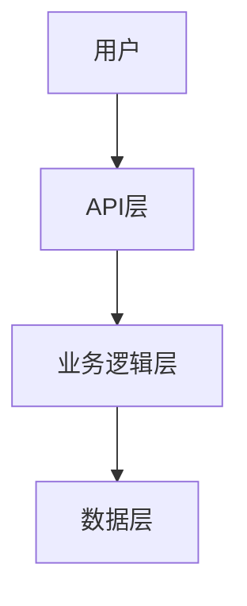
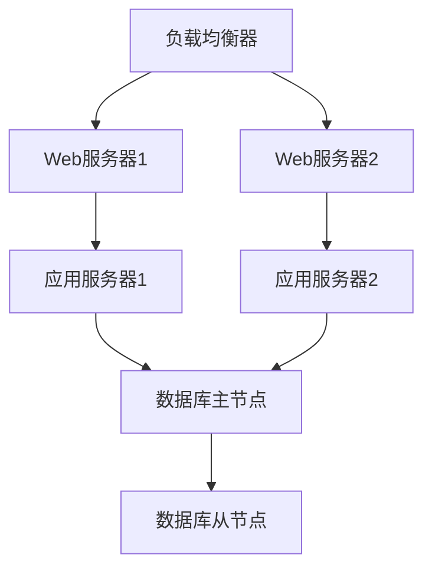

# 项目文档化模板

基于 Aura 项目的文档优化实践，本模板提供了一套完整的项目文档体系和 LLM/Agent 协作优化方案，可直接应用于其他项目。

## 📋 模板概述

### 适用场景
- 中大型软件项目
- 需要团队协作的项目
- 希望提升 LLM/Agent 协作体验的项目
- 需要完整文档体系的开源项目

### 核心价值
- **降低上手门槛**: 新开发者快速理解项目架构
- **提升协作效率**: 标准化的文档结构和开发流程
- **增强 AI 友好性**: 丰富的代码注释和文档说明
- **保证项目质量**: 完整的测试和部署规范

## 📁 文档结构模板

### 根目录文件
```
project-root/
├── README.md                 # 项目概览和快速开始
├── docs/                     # 文档目录
│   ├── ARCHITECTURE.md       # 架构设计文档(ADR)
│   ├── API.md               # API接口文档
│   ├── DEVELOPMENT.md       # 开发指南
│   ├── TESTING.md           # 测试策略
│   ├── DEPLOYMENT.md        # 部署指南
│   └── project-documentation-template.md  # 本模板
└── ...
```

### 1. README.md 模板

```markdown
# 项目名称

> 一句话描述项目的核心价值和功能

## 🚀 快速开始

### 环境要求
- Node.js >= 16.0.0
- Python >= 3.8
- 其他依赖...

### 安装步骤
```bash
# 1. 克隆项目
git clone <repository-url>
cd <project-name>

# 2. 安装依赖
npm install
# 或
pip install -r requirements.txt

# 3. 配置环境
cp .env.example .env
# 编辑 .env 文件

# 4. 启动项目
npm start
# 或
python main.py
```

## 📖 文档导航

- [📐 架构设计](docs/ARCHITECTURE.md) - 系统架构和设计决策
- [🔌 API 文档](docs/API.md) - 接口规范和使用示例
- [👨‍💻 开发指南](docs/DEVELOPMENT.md) - 开发环境和编码规范
- [🧪 测试文档](docs/TESTING.md) - 测试策略和规范
- [🚀 部署指南](docs/DEPLOYMENT.md) - 部署和运维文档

## 🏗️ 项目结构

```
src/
├── core/           # 核心业务逻辑
├── api/            # API 接口层
├── utils/          # 工具函数
├── config/         # 配置文件
└── tests/          # 测试文件
```

## 🤝 贡献指南

1. Fork 项目
2. 创建功能分支 (`git checkout -b feature/AmazingFeature`)
3. 提交更改 (`git commit -m 'Add some AmazingFeature'`)
4. 推送到分支 (`git push origin feature/AmazingFeature`)
5. 创建 Pull Request

## 📄 许可证

本项目采用 [MIT](LICENSE) 许可证。
```

### 2. ARCHITECTURE.md 模板

```markdown
# 架构设计文档 (ADR)

## 系统概览

### 核心理念
- 描述项目的核心设计理念
- 解释为什么选择这种架构

### 架构图


## 架构决策记录 (ADR)

### ADR-001: 选择微服务架构
- **状态**: 已接受
- **决策**: 采用微服务架构而非单体架构
- **背景**: 项目规模较大，需要支持团队并行开发
- **决策**: 将系统拆分为多个独立的微服务
- **后果**: 
  - 优点: 独立部署、技术栈灵活、团队自治
  - 缺点: 增加了系统复杂性、网络通信开销

### ADR-002: 数据库选择
- **状态**: 已接受
- **决策**: 使用 PostgreSQL 作为主数据库
- **背景**: 需要支持复杂查询和事务
- **后果**: 提供了强一致性，但可能在高并发下成为瓶颈

## 核心组件

### 组件A
- **职责**: 描述组件的主要职责
- **接口**: 对外提供的接口
- **依赖**: 依赖的其他组件

### 组件B
- **职责**: ...
- **接口**: ...
- **依赖**: ...

## 数据流

描述数据在系统中的流转过程。

## 安全考虑

- 认证和授权机制
- 数据加密
- 输入验证
- 安全审计

## 性能考虑

- 缓存策略
- 数据库优化
- 负载均衡
- 监控指标
```

### 3. API.md 模板

```markdown
# API 接口文档

## 基础信息

- **Base URL**: `https://api.example.com/v1`
- **认证方式**: Bearer Token
- **数据格式**: JSON

## 认证

所有 API 请求都需要在 Header 中包含认证信息：

```http
Authorization: Bearer <your-token>
Content-Type: application/json
```

## 核心接口

### 用户管理

#### 创建用户

```http
POST /users
```

**请求参数**:
```json
{
  "name": "string",
  "email": "string",
  "password": "string"
}
```

**响应示例**:
```json
{
  "id": "12345",
  "name": "John Doe",
  "email": "john@example.com",
  "created_at": "2024-01-01T00:00:00Z"
}
```

#### 获取用户信息

```http
GET /users/{id}
```

**路径参数**:
- `id` (string): 用户ID

**响应示例**:
```json
{
  "id": "12345",
  "name": "John Doe",
  "email": "john@example.com",
  "created_at": "2024-01-01T00:00:00Z"
}
```

## 错误处理

### 错误响应格式

```json
{
  "error": {
    "code": "VALIDATION_ERROR",
    "message": "请求参数验证失败",
    "details": {
      "field": "email",
      "reason": "邮箱格式不正确"
    }
  }
}
```

### 常见错误码

| 状态码 | 错误码 | 描述 |
|--------|--------|------|
| 400 | VALIDATION_ERROR | 请求参数验证失败 |
| 401 | UNAUTHORIZED | 未授权访问 |
| 403 | FORBIDDEN | 权限不足 |
| 404 | NOT_FOUND | 资源不存在 |
| 500 | INTERNAL_ERROR | 服务器内部错误 |

## SDK 和示例

### JavaScript SDK

```javascript
const client = new APIClient({
  baseURL: 'https://api.example.com/v1',
  token: 'your-token'
});

// 创建用户
const user = await client.users.create({
  name: 'John Doe',
  email: 'john@example.com',
  password: 'password123'
});

console.log(user);
```

### Python SDK

```python
from api_client import APIClient

client = APIClient(
    base_url='https://api.example.com/v1',
    token='your-token'
)

# 创建用户
user = client.users.create({
    'name': 'John Doe',
    'email': 'john@example.com',
    'password': 'password123'
})

print(user)
```
```

### 4. DEVELOPMENT.md 模板

```markdown
# 开发指南

## 开发环境设置

### 系统要求
- 操作系统: Windows 10+, macOS 10.15+, Ubuntu 18.04+
- Node.js: >= 16.0.0
- Python: >= 3.8
- Git: >= 2.20

### 开发工具推荐
- **IDE**: VS Code, PyCharm, WebStorm
- **数据库工具**: DBeaver, pgAdmin
- **API 测试**: Postman, Insomnia
- **版本控制**: Git + GitHub/GitLab

### 环境配置

1. **克隆项目**
   ```bash
   git clone <repository-url>
   cd <project-name>
   ```

2. **安装依赖**
   ```bash
   # 前端依赖
   npm install
   
   # 后端依赖
   pip install -r requirements.txt
   ```

3. **配置环境变量**
   ```bash
   cp .env.example .env
   # 编辑 .env 文件，填入必要的配置
   ```

4. **数据库设置**
   ```bash
   # 创建数据库
   createdb project_db
   
   # 运行迁移
   python manage.py migrate
   ```

## 编码规范

### 代码风格

#### Python
- 遵循 PEP 8 规范
- 使用 Black 进行代码格式化
- 使用 isort 进行导入排序
- 使用 flake8 进行代码检查

```bash
# 格式化代码
black .
isort .

# 检查代码
flake8 .
```

#### JavaScript/TypeScript
- 使用 ESLint + Prettier
- 遵循 Airbnb 风格指南

```bash
# 格式化代码
npm run format

# 检查代码
npm run lint
```

### 命名规范

- **文件名**: 使用小写字母和下划线 (`user_service.py`)
- **类名**: 使用 PascalCase (`UserService`)
- **函数名**: 使用 snake_case (`get_user_info`)
- **常量**: 使用大写字母和下划线 (`MAX_RETRY_COUNT`)

### 注释规范

#### Python Docstring
```python
def calculate_total(items: List[Item], tax_rate: float) -> float:
    """计算订单总金额
    
    Args:
        items: 订单项目列表
        tax_rate: 税率 (0.0-1.0)
        
    Returns:
        float: 包含税费的总金额
        
    Raises:
        ValueError: 当税率超出有效范围时
        
    Example:
        >>> items = [Item(price=10.0), Item(price=20.0)]
        >>> calculate_total(items, 0.1)
        33.0
    """
    if not 0.0 <= tax_rate <= 1.0:
        raise ValueError("税率必须在 0.0 到 1.0 之间")
        
    subtotal = sum(item.price for item in items)
    return subtotal * (1 + tax_rate)
```

#### JavaScript JSDoc
```javascript
/**
 * 计算订单总金额
 * @param {Array<Object>} items - 订单项目列表
 * @param {number} taxRate - 税率 (0.0-1.0)
 * @returns {number} 包含税费的总金额
 * @throws {Error} 当税率超出有效范围时
 * @example
 * const items = [{price: 10.0}, {price: 20.0}];
 * const total = calculateTotal(items, 0.1);
 * console.log(total); // 33.0
 */
function calculateTotal(items, taxRate) {
    if (taxRate < 0.0 || taxRate > 1.0) {
        throw new Error('税率必须在 0.0 到 1.0 之间');
    }
    
    const subtotal = items.reduce((sum, item) => sum + item.price, 0);
    return subtotal * (1 + taxRate);
}
```

## Git 工作流

### 分支策略

- `main`: 主分支，保持稳定
- `develop`: 开发分支，集成最新功能
- `feature/*`: 功能分支
- `hotfix/*`: 紧急修复分支
- `release/*`: 发布分支

### 提交规范

使用 Conventional Commits 规范：

```
<type>[optional scope]: <description>

[optional body]

[optional footer(s)]
```

**类型说明**:
- `feat`: 新功能
- `fix`: 修复 bug
- `docs`: 文档更新
- `style`: 代码格式调整
- `refactor`: 代码重构
- `test`: 测试相关
- `chore`: 构建过程或辅助工具的变动

**示例**:
```
feat(user): 添加用户注册功能

- 实现用户注册 API
- 添加邮箱验证
- 更新用户模型

Closes #123
```

## 开发流程

### 功能开发流程

1. **创建功能分支**
   ```bash
   git checkout develop
   git pull origin develop
   git checkout -b feature/user-registration
   ```

2. **开发功能**
   - 编写代码
   - 添加测试
   - 更新文档

3. **提交代码**
   ```bash
   git add .
   git commit -m "feat(user): 添加用户注册功能"
   git push origin feature/user-registration
   ```

4. **创建 Pull Request**
   - 填写 PR 模板
   - 请求代码审查
   - 确保 CI 通过

5. **合并代码**
   - 代码审查通过
   - 合并到 develop 分支
   - 删除功能分支

### 代码审查清单

- [ ] 代码符合编码规范
- [ ] 功能实现正确
- [ ] 测试覆盖充分
- [ ] 文档更新完整
- [ ] 性能影响可接受
- [ ] 安全性考虑充分

## 调试技巧

### 日志调试

```python
import logging

logger = logging.getLogger(__name__)

def process_user_data(user_data):
    logger.info(f"开始处理用户数据: {user_data['id']}")
    
    try:
        # 处理逻辑
        result = do_something(user_data)
        logger.info(f"用户数据处理成功: {result}")
        return result
    except Exception as e:
        logger.error(f"用户数据处理失败: {e}", exc_info=True)
        raise
```

### 断点调试

```python
# 使用 pdb 进行调试
import pdb

def complex_function(data):
    pdb.set_trace()  # 设置断点
    # 复杂逻辑
    return result
```

### 性能分析

```python
import cProfile
import pstats

# 性能分析
cProfile.run('your_function()', 'profile_stats')
stats = pstats.Stats('profile_stats')
stats.sort_stats('cumulative').print_stats(10)
```

## 常见问题

### Q: 如何解决依赖冲突？
A: 使用虚拟环境隔离依赖，定期更新 requirements.txt

### Q: 数据库迁移失败怎么办？
A: 检查迁移文件，必要时回滚到上一个版本

### Q: 如何提高开发效率？
A: 使用代码片段、自动化工具、熟悉快捷键
```

### 5. TESTING.md 模板

```markdown
# 测试文档

## 测试策略

### 测试金字塔

```
    /\     E2E Tests (少量)
   /  \    
  /____\   Integration Tests (适量)
 /______\  Unit Tests (大量)
```

- **单元测试**: 测试单个函数或类的功能
- **集成测试**: 测试组件间的交互
- **端到端测试**: 测试完整的用户场景

### 测试原则

1. **快速**: 测试应该快速执行
2. **独立**: 测试之间不应相互依赖
3. **可重复**: 测试结果应该一致
4. **自验证**: 测试应该明确通过或失败
5. **及时**: 测试应该及时编写

## 测试环境

### 环境配置

```bash
# 安装测试依赖
pip install -r requirements-test.txt

# 设置测试环境变量
export TESTING=true
export DATABASE_URL=sqlite:///test.db
```

### 测试数据库

```python
# conftest.py
import pytest
from sqlalchemy import create_engine
from sqlalchemy.orm import sessionmaker

@pytest.fixture(scope="session")
def test_db():
    engine = create_engine("sqlite:///test.db")
    TestingSessionLocal = sessionmaker(bind=engine)
    
    # 创建表
    Base.metadata.create_all(bind=engine)
    
    yield TestingSessionLocal
    
    # 清理
    Base.metadata.drop_all(bind=engine)
```

## 单元测试

### 测试结构

```
tests/
├── unit/
│   ├── test_user_service.py
│   ├── test_order_service.py
│   └── ...
├── integration/
│   ├── test_api_endpoints.py
│   └── ...
├── e2e/
│   ├── test_user_journey.py
│   └── ...
└── conftest.py
```

### 测试示例

```python
# test_user_service.py
import pytest
from unittest.mock import Mock, patch
from services.user_service import UserService
from models.user import User

class TestUserService:
    
    def setup_method(self):
        """每个测试方法执行前的设置"""
        self.user_service = UserService()
        self.mock_db = Mock()
        
    def test_create_user_success(self):
        """测试成功创建用户"""
        # Arrange
        user_data = {
            'name': 'John Doe',
            'email': 'john@example.com',
            'password': 'password123'
        }
        expected_user = User(id=1, **user_data)
        self.mock_db.save.return_value = expected_user
        
        # Act
        result = self.user_service.create_user(user_data, self.mock_db)
        
        # Assert
        assert result.name == 'John Doe'
        assert result.email == 'john@example.com'
        self.mock_db.save.assert_called_once()
        
    def test_create_user_duplicate_email(self):
        """测试创建重复邮箱用户"""
        # Arrange
        user_data = {'email': 'existing@example.com'}
        self.mock_db.find_by_email.return_value = User(email='existing@example.com')
        
        # Act & Assert
        with pytest.raises(ValueError, match="邮箱已存在"):
            self.user_service.create_user(user_data, self.mock_db)
            
    @patch('services.user_service.send_email')
    def test_send_welcome_email(self, mock_send_email):
        """测试发送欢迎邮件"""
        # Arrange
        user = User(name='John', email='john@example.com')
        
        # Act
        self.user_service.send_welcome_email(user)
        
        # Assert
        mock_send_email.assert_called_once_with(
            to='john@example.com',
            subject='欢迎加入我们！',
            template='welcome.html',
            context={'name': 'John'}
        )
```

### 参数化测试

```python
@pytest.mark.parametrize("input_data,expected", [
    ({"price": 100, "tax_rate": 0.1}, 110.0),
    ({"price": 200, "tax_rate": 0.2}, 240.0),
    ({"price": 0, "tax_rate": 0.1}, 0.0),
])
def test_calculate_total(input_data, expected):
    result = calculate_total(input_data["price"], input_data["tax_rate"])
    assert result == expected
```

## 集成测试

### API 测试

```python
# test_api_endpoints.py
import pytest
from fastapi.testclient import TestClient
from main import app

client = TestClient(app)

class TestUserAPI:
    
    def test_create_user_endpoint(self):
        """测试创建用户 API"""
        user_data = {
            "name": "John Doe",
            "email": "john@example.com",
            "password": "password123"
        }
        
        response = client.post("/users", json=user_data)
        
        assert response.status_code == 201
        data = response.json()
        assert data["name"] == "John Doe"
        assert data["email"] == "john@example.com"
        assert "id" in data
        assert "password" not in data  # 确保密码不返回
        
    def test_get_user_endpoint(self):
        """测试获取用户 API"""
        # 先创建用户
        user_data = {"name": "Jane", "email": "jane@example.com"}
        create_response = client.post("/users", json=user_data)
        user_id = create_response.json()["id"]
        
        # 获取用户
        response = client.get(f"/users/{user_id}")
        
        assert response.status_code == 200
        data = response.json()
        assert data["name"] == "Jane"
        
    def test_get_nonexistent_user(self):
        """测试获取不存在的用户"""
        response = client.get("/users/99999")
        
        assert response.status_code == 404
        assert "用户不存在" in response.json()["detail"]
```

### 数据库测试

```python
# test_database.py
import pytest
from sqlalchemy.orm import Session
from models.user import User
from database import get_db

def test_user_crud_operations(test_db):
    """测试用户 CRUD 操作"""
    db: Session = next(test_db())
    
    # Create
    user = User(name="Test User", email="test@example.com")
    db.add(user)
    db.commit()
    db.refresh(user)
    
    assert user.id is not None
    
    # Read
    found_user = db.query(User).filter(User.email == "test@example.com").first()
    assert found_user is not None
    assert found_user.name == "Test User"
    
    # Update
    found_user.name = "Updated User"
    db.commit()
    
    updated_user = db.query(User).filter(User.id == user.id).first()
    assert updated_user.name == "Updated User"
    
    # Delete
    db.delete(updated_user)
    db.commit()
    
    deleted_user = db.query(User).filter(User.id == user.id).first()
    assert deleted_user is None
```

## 端到端测试

### Selenium 测试

```python
# test_user_journey.py
import pytest
from selenium import webdriver
from selenium.webdriver.common.by import By
from selenium.webdriver.support.ui import WebDriverWait
from selenium.webdriver.support import expected_conditions as EC

class TestUserJourney:
    
    @pytest.fixture(autouse=True)
    def setup(self):
        self.driver = webdriver.Chrome()
        self.driver.implicitly_wait(10)
        yield
        self.driver.quit()
        
    def test_user_registration_flow(self):
        """测试用户注册流程"""
        driver = self.driver
        
        # 访问注册页面
        driver.get("http://localhost:3000/register")
        
        # 填写注册表单
        driver.find_element(By.NAME, "name").send_keys("John Doe")
        driver.find_element(By.NAME, "email").send_keys("john@example.com")
        driver.find_element(By.NAME, "password").send_keys("password123")
        
        # 提交表单
        driver.find_element(By.CSS_SELECTOR, "button[type='submit']").click()
        
        # 验证跳转到成功页面
        WebDriverWait(driver, 10).until(
            EC.presence_of_element_located((By.CLASS_NAME, "success-message"))
        )
        
        success_message = driver.find_element(By.CLASS_NAME, "success-message")
        assert "注册成功" in success_message.text
```

## 测试覆盖率

### 配置覆盖率

```bash
# 安装 coverage
pip install coverage

# 运行测试并收集覆盖率
coverage run -m pytest

# 生成覆盖率报告
coverage report
coverage html  # 生成 HTML 报告
```

### 覆盖率配置

```ini
# .coveragerc
[run]
source = src/
omit = 
    */tests/*
    */venv/*
    */migrations/*
    */settings/*

[report]
exclude_lines =
    pragma: no cover
    def __repr__
    raise AssertionError
    raise NotImplementedError
```

## 性能测试

### 负载测试

```python
# test_performance.py
import pytest
import time
from concurrent.futures import ThreadPoolExecutor
from fastapi.testclient import TestClient
from main import app

client = TestClient(app)

def test_api_response_time():
    """测试 API 响应时间"""
    start_time = time.time()
    response = client.get("/users/1")
    end_time = time.time()
    
    assert response.status_code == 200
    assert (end_time - start_time) < 1.0  # 响应时间小于 1 秒
    
def test_concurrent_requests():
    """测试并发请求"""
    def make_request():
        return client.get("/users/1")
    
    with ThreadPoolExecutor(max_workers=10) as executor:
        futures = [executor.submit(make_request) for _ in range(100)]
        results = [future.result() for future in futures]
    
    # 验证所有请求都成功
    assert all(result.status_code == 200 for result in results)
```

## 测试最佳实践

### 1. 测试命名
- 使用描述性的测试名称
- 遵循 `test_<功能>_<场景>_<期望结果>` 格式

### 2. 测试结构
- 使用 Arrange-Act-Assert 模式
- 每个测试只验证一个功能点

### 3. 测试数据
- 使用工厂模式创建测试数据
- 避免硬编码测试数据

### 4. Mock 使用
- 对外部依赖使用 Mock
- 验证 Mock 的调用

### 5. 测试维护
- 定期清理过时的测试
- 保持测试代码的质量

## 持续集成

### GitHub Actions 配置

```yaml
# .github/workflows/test.yml
name: Tests

on: [push, pull_request]

jobs:
  test:
    runs-on: ubuntu-latest
    
    services:
      postgres:
        image: postgres:13
        env:
          POSTGRES_PASSWORD: postgres
        options: >-
          --health-cmd pg_isready
          --health-interval 10s
          --health-timeout 5s
          --health-retries 5
    
    steps:
    - uses: actions/checkout@v2
    
    - name: Set up Python
      uses: actions/setup-python@v2
      with:
        python-version: 3.9
    
    - name: Install dependencies
      run: |
        pip install -r requirements.txt
        pip install -r requirements-test.txt
    
    - name: Run tests
      run: |
        coverage run -m pytest
        coverage xml
    
    - name: Upload coverage
      uses: codecov/codecov-action@v1
      with:
        file: ./coverage.xml
```

## 测试工具推荐

- **pytest**: Python 测试框架
- **coverage**: 代码覆盖率工具
- **factory_boy**: 测试数据工厂
- **responses**: HTTP 请求 Mock
- **selenium**: Web UI 测试
- **locust**: 性能测试工具
```

### 6. DEPLOYMENT.md 模板

```markdown
# 部署指南

## 部署架构

### 生产环境架构



### 环境分层

- **开发环境 (Development)**: 本地开发和调试
- **测试环境 (Testing)**: 自动化测试和集成测试
- **预发布环境 (Staging)**: 生产环境的完整复制
- **生产环境 (Production)**: 正式对外服务

## 环境配置

### 系统要求

#### 最小配置
- CPU: 2 核
- 内存: 4GB
- 存储: 20GB SSD
- 网络: 100Mbps

#### 推荐配置
- CPU: 4 核
- 内存: 8GB
- 存储: 50GB SSD
- 网络: 1Gbps

### 软件依赖

```bash
# Ubuntu 20.04 LTS
sudo apt update
sudo apt install -y \
    python3.9 \
    python3-pip \
    postgresql-12 \
    redis-server \
    nginx \
    supervisor
```

## Docker 部署

### Dockerfile

```dockerfile
# Dockerfile
FROM python:3.9-slim

# 设置工作目录
WORKDIR /app

# 安装系统依赖
RUN apt-get update && apt-get install -y \
    gcc \
    && rm -rf /var/lib/apt/lists/*

# 复制依赖文件
COPY requirements.txt .

# 安装 Python 依赖
RUN pip install --no-cache-dir -r requirements.txt

# 复制应用代码
COPY . .

# 创建非 root 用户
RUN useradd -m -u 1000 appuser && chown -R appuser:appuser /app
USER appuser

# 暴露端口
EXPOSE 8000

# 启动命令
CMD ["gunicorn", "--bind", "0.0.0.0:8000", "main:app"]
```

### docker-compose.yml

```yaml
# docker-compose.yml
version: '3.8'

services:
  web:
    build: .
    ports:
      - "8000:8000"
    environment:
      - DATABASE_URL=postgresql://user:password@db:5432/myapp
      - REDIS_URL=redis://redis:6379/0
    depends_on:
      - db
      - redis
    volumes:
      - ./logs:/app/logs
    restart: unless-stopped

  db:
    image: postgres:13
    environment:
      - POSTGRES_DB=myapp
      - POSTGRES_USER=user
      - POSTGRES_PASSWORD=password
    volumes:
      - postgres_data:/var/lib/postgresql/data
      - ./backups:/backups
    restart: unless-stopped

  redis:
    image: redis:6-alpine
    restart: unless-stopped

  nginx:
    image: nginx:alpine
    ports:
      - "80:80"
      - "443:443"
    volumes:
      - ./nginx.conf:/etc/nginx/nginx.conf
      - ./ssl:/etc/nginx/ssl
    depends_on:
      - web
    restart: unless-stopped

volumes:
  postgres_data:
```

### 部署脚本

```bash
#!/bin/bash
# deploy.sh

set -e

echo "开始部署..."

# 拉取最新代码
git pull origin main

# 构建镜像
docker-compose build

# 停止旧容器
docker-compose down

# 启动新容器
docker-compose up -d

# 等待服务启动
sleep 10

# 运行数据库迁移
docker-compose exec web python manage.py migrate

# 收集静态文件
docker-compose exec web python manage.py collectstatic --noinput

# 健康检查
if curl -f http://localhost:8000/health; then
    echo "部署成功！"
else
    echo "部署失败，正在回滚..."
    docker-compose down
    docker-compose up -d
    exit 1
fi
```

## Kubernetes 部署

### 部署配置

```yaml
# k8s/deployment.yaml
apiVersion: apps/v1
kind: Deployment
metadata:
  name: myapp
  labels:
    app: myapp
spec:
  replicas: 3
  selector:
    matchLabels:
      app: myapp
  template:
    metadata:
      labels:
        app: myapp
    spec:
      containers:
      - name: myapp
        image: myapp:latest
        ports:
        - containerPort: 8000
        env:
        - name: DATABASE_URL
          valueFrom:
            secretKeyRef:
              name: myapp-secrets
              key: database-url
        resources:
          requests:
            memory: "256Mi"
            cpu: "250m"
          limits:
            memory: "512Mi"
            cpu: "500m"
        livenessProbe:
          httpGet:
            path: /health
            port: 8000
          initialDelaySeconds: 30
          periodSeconds: 10
        readinessProbe:
          httpGet:
            path: /ready
            port: 8000
          initialDelaySeconds: 5
          periodSeconds: 5
---
apiVersion: v1
kind: Service
metadata:
  name: myapp-service
spec:
  selector:
    app: myapp
  ports:
  - protocol: TCP
    port: 80
    targetPort: 8000
  type: LoadBalancer
```

### 配置管理

```yaml
# k8s/configmap.yaml
apiVersion: v1
kind: ConfigMap
metadata:
  name: myapp-config
data:
  DEBUG: "false"
  LOG_LEVEL: "INFO"
  ALLOWED_HOSTS: "myapp.com,www.myapp.com"
---
apiVersion: v1
kind: Secret
metadata:
  name: myapp-secrets
type: Opaque
data:
  database-url: <base64-encoded-database-url>
  secret-key: <base64-encoded-secret-key>
```

## 数据库部署

### PostgreSQL 配置

```sql
-- 创建数据库和用户
CREATE DATABASE myapp;
CREATE USER myapp_user WITH PASSWORD 'secure_password';
GRANT ALL PRIVILEGES ON DATABASE myapp TO myapp_user;

-- 性能优化配置
ALTER SYSTEM SET shared_buffers = '256MB';
ALTER SYSTEM SET effective_cache_size = '1GB';
ALTER SYSTEM SET maintenance_work_mem = '64MB';
ALTER SYSTEM SET checkpoint_completion_target = 0.9;
ALTER SYSTEM SET wal_buffers = '16MB';
ALTER SYSTEM SET default_statistics_target = 100;

SELECT pg_reload_conf();
```

### 数据库备份

```bash
#!/bin/bash
# backup.sh

BACKUP_DIR="/backups"
DATE=$(date +%Y%m%d_%H%M%S)
BACKUP_FILE="$BACKUP_DIR/myapp_$DATE.sql"

# 创建备份
pg_dump -h localhost -U myapp_user myapp > $BACKUP_FILE

# 压缩备份
gzip $BACKUP_FILE

# 删除 7 天前的备份
find $BACKUP_DIR -name "*.sql.gz" -mtime +7 -delete

echo "备份完成: $BACKUP_FILE.gz"
```

## 监控和日志

### 应用监控

```python
# monitoring.py
from prometheus_client import Counter, Histogram, generate_latest
from flask import Response

# 定义指标
REQUEST_COUNT = Counter('http_requests_total', 'Total HTTP requests', ['method', 'endpoint'])
REQUEST_DURATION = Histogram('http_request_duration_seconds', 'HTTP request duration')

@app.route('/metrics')
def metrics():
    return Response(generate_latest(), mimetype='text/plain')

@app.before_request
def before_request():
    request.start_time = time.time()

@app.after_request
def after_request(response):
    REQUEST_COUNT.labels(method=request.method, endpoint=request.endpoint).inc()
    REQUEST_DURATION.observe(time.time() - request.start_time)
    return response
```

### 日志配置

```python
# logging_config.py
import logging
import logging.config

LOGGING_CONFIG = {
    'version': 1,
    'disable_existing_loggers': False,
    'formatters': {
        'standard': {
            'format': '%(asctime)s [%(levelname)s] %(name)s: %(message)s'
        },
        'json': {
            'format': '%(asctime)s %(name)s %(levelname)s %(message)s',
            'class': 'pythonjsonlogger.jsonlogger.JsonFormatter'
        }
    },
    'handlers': {
        'default': {
            'level': 'INFO',
            'formatter': 'standard',
            'class': 'logging.StreamHandler',
        },
        'file': {
            'level': 'INFO',
            'formatter': 'json',
            'class': 'logging.handlers.RotatingFileHandler',
            'filename': '/app/logs/app.log',
            'maxBytes': 10485760,  # 10MB
            'backupCount': 5
        }
    },
    'loggers': {
        '': {
            'handlers': ['default', 'file'],
            'level': 'INFO',
            'propagate': False
        }
    }
}

logging.config.dictConfig(LOGGING_CONFIG)
```

## 安全配置

### HTTPS 配置

```nginx
# nginx.conf
server {
    listen 80;
    server_name myapp.com www.myapp.com;
    return 301 https://$server_name$request_uri;
}

server {
    listen 443 ssl http2;
    server_name myapp.com www.myapp.com;

    ssl_certificate /etc/nginx/ssl/cert.pem;
    ssl_certificate_key /etc/nginx/ssl/key.pem;
    
    ssl_protocols TLSv1.2 TLSv1.3;
    ssl_ciphers ECDHE-RSA-AES256-GCM-SHA512:DHE-RSA-AES256-GCM-SHA512;
    ssl_prefer_server_ciphers off;
    
    add_header Strict-Transport-Security "max-age=63072000" always;
    add_header X-Frame-Options DENY;
    add_header X-Content-Type-Options nosniff;
    
    location / {
        proxy_pass http://web:8000;
        proxy_set_header Host $host;
        proxy_set_header X-Real-IP $remote_addr;
        proxy_set_header X-Forwarded-For $proxy_add_x_forwarded_for;
        proxy_set_header X-Forwarded-Proto $scheme;
    }
}
```

### 防火墙配置

```bash
# 配置 UFW 防火墙
sudo ufw default deny incoming
sudo ufw default allow outgoing
sudo ufw allow ssh
sudo ufw allow 80/tcp
sudo ufw allow 443/tcp
sudo ufw enable
```

## 性能优化

### 应用优化

```python
# 数据库连接池
from sqlalchemy import create_engine
from sqlalchemy.pool import QueuePool

engine = create_engine(
    DATABASE_URL,
    poolclass=QueuePool,
    pool_size=20,
    max_overflow=30,
    pool_pre_ping=True
)

# Redis 缓存
import redis
from functools import wraps

redis_client = redis.Redis(host='redis', port=6379, db=0)

def cache_result(expiration=300):
    def decorator(func):
        @wraps(func)
        def wrapper(*args, **kwargs):
            cache_key = f"{func.__name__}:{hash(str(args) + str(kwargs))}"
            cached_result = redis_client.get(cache_key)
            
            if cached_result:
                return json.loads(cached_result)
            
            result = func(*args, **kwargs)
            redis_client.setex(cache_key, expiration, json.dumps(result))
            return result
        return wrapper
    return decorator
```

### 数据库优化

```sql
-- 创建索引
CREATE INDEX CONCURRENTLY idx_users_email ON users(email);
CREATE INDEX CONCURRENTLY idx_orders_user_id ON orders(user_id);
CREATE INDEX CONCURRENTLY idx_orders_created_at ON orders(created_at);

-- 分析查询性能
EXPLAIN ANALYZE SELECT * FROM users WHERE email = 'user@example.com';
```

## 故障排除

### 常见问题

#### 1. 应用无法启动
```bash
# 检查日志
docker-compose logs web

# 检查端口占用
netstat -tulpn | grep :8000

# 检查环境变量
docker-compose exec web env
```

#### 2. 数据库连接失败
```bash
# 检查数据库状态
docker-compose exec db pg_isready

# 检查连接配置
psql -h localhost -U myapp_user -d myapp
```

#### 3. 性能问题
```bash
# 检查资源使用
docker stats

# 检查慢查询
SELECT query, mean_time, calls FROM pg_stat_statements ORDER BY mean_time DESC LIMIT 10;
```

### 应急响应

```bash
#!/bin/bash
# emergency_rollback.sh

echo "执行紧急回滚..."

# 停止当前服务
docker-compose down

# 切换到上一个版本
git checkout HEAD~1

# 重新部署
docker-compose up -d

# 验证服务状态
if curl -f http://localhost:8000/health; then
    echo "回滚成功！"
else
    echo "回滚失败，请手动处理"
    exit 1
fi
```

## 运维手册

### 日常维护

1. **每日检查**
   - 服务状态监控
   - 错误日志检查
   - 资源使用情况

2. **每周维护**
   - 数据库备份验证
   - 安全更新检查
   - 性能指标分析

3. **每月维护**
   - 日志清理
   - 数据库优化
   - 容量规划评估

### 监控指标

- **应用指标**: 响应时间、错误率、吞吐量
- **系统指标**: CPU、内存、磁盘、网络
- **业务指标**: 用户活跃度、转化率、收入

### 告警配置

```yaml
# alertmanager.yml
groups:
- name: myapp
  rules:
  - alert: HighErrorRate
    expr: rate(http_requests_total{status=~"5.."}[5m]) > 0.1
    for: 5m
    annotations:
      summary: "应用错误率过高"
      description: "错误率超过 10%"
      
  - alert: HighMemoryUsage
    expr: (node_memory_MemTotal_bytes - node_memory_MemAvailable_bytes) / node_memory_MemTotal_bytes > 0.9
    for: 5m
    annotations:
      summary: "内存使用率过高"
      description: "内存使用率超过 90%"
```
```

## 🔧 代码注释优化模板

### Python 模块文档模板

```python
"""
模块名称 (Module Name)

这是模块的简要描述，说明模块的主要功能和用途。

核心职责:
1. **主要功能1**: 详细描述功能1的作用
2. **主要功能2**: 详细描述功能2的作用
3. **主要功能3**: 详细描述功能3的作用

架构设计:
- **设计模式**: 说明使用的设计模式和原因
- **核心组件**: 列出主要的类和函数
- **依赖关系**: 说明与其他模块的依赖关系

使用示例:
    ```python
    # 基本使用示例
    from module_name import ClassName
    
    instance = ClassName(param1="value1")
    result = instance.method_name()
    print(f"结果: {result}")
    ```

性能考虑:
- 时间复杂度和空间复杂度说明
- 性能瓶颈和优化建议
- 并发安全性说明

扩展性:
- 如何扩展功能
- 插件机制说明
- 配置选项说明

Author: 作者名称
Created: 创建日期
Last Modified: 最后修改日期
"""
```

### 类文档模板

```python
class ExampleClass:
    """示例类的详细说明
    
    这个类负责处理特定的业务逻辑，提供标准化的接口。
    
    主要功能:
    - **数据处理**: 处理输入数据并进行验证
    - **业务逻辑**: 执行核心业务逻辑
    - **结果输出**: 格式化并返回处理结果
    
    设计模式:
    - 使用单例模式确保全局唯一实例
    - 实现观察者模式支持事件通知
    
    Attributes:
        attribute1 (str): 属性1的描述
        attribute2 (int): 属性2的描述
        _private_attr (dict): 私有属性的描述
    
    Example:
        ```python
        # 创建实例
        instance = ExampleClass(param1="value")
        
        # 调用方法
        result = instance.process_data(data)
        print(f"处理结果: {result}")
        ```
    
    Note:
        - 线程安全性说明
        - 使用注意事项
        - 已知限制和约束
    """
    
    def __init__(self, param1: str, param2: Optional[int] = None):
        """初始化示例类
        
        设置类的初始状态和必要的配置。
        
        初始化流程:
        1. **参数验证**: 验证输入参数的有效性
        2. **状态设置**: 初始化内部状态变量
        3. **资源准备**: 准备必要的资源和连接
        4. **配置加载**: 加载配置文件和环境变量
        
        Args:
            param1: 必需参数，用于设置基本配置
            param2: 可选参数，默认为None时使用系统默认值
            
        Raises:
            ValueError: 当param1为空或格式不正确时
            ConfigError: 当配置文件加载失败时
            
        Example:
            ```python
            # 基本初始化
            instance = ExampleClass("config_value")
            
            # 带可选参数的初始化
            instance = ExampleClass("config_value", param2=100)
            ```
        
        Note:
            - 初始化过程中会验证所有必需的依赖
            - 如果初始化失败，对象将处于不可用状态
        """
```

### 方法文档模板

```python
def complex_method(self, data: Dict[str, Any], 
                  options: Optional[ProcessingOptions] = None) -> ProcessingResult:
    """执行复杂的数据处理操作
    
    这是系统的核心处理方法，负责协调多个子系统完成数据处理任务。
    
    处理流程:
    1. **数据验证**: 验证输入数据的格式和完整性
    2. **预处理**: 清理和标准化数据
    3. **核心处理**: 执行主要的业务逻辑
    4. **后处理**: 格式化输出结果
    5. **错误处理**: 处理异常情况并提供降级方案
    
    Args:
        data: 待处理的数据字典，必须包含以下字段:
            - 'id' (str): 数据唯一标识符
            - 'content' (Any): 实际数据内容
            - 'metadata' (dict, optional): 元数据信息
        options: 处理选项配置，包含:
            - timeout (int): 处理超时时间(秒)，默认30秒
            - retry_count (int): 重试次数，默认3次
            - strict_mode (bool): 是否启用严格模式，默认False
    
    Returns:
        ProcessingResult: 处理结果对象，包含:
            - success (bool): 处理是否成功
            - data (Any): 处理后的数据
            - metadata (dict): 处理过程的元数据
            - errors (List[str]): 错误信息列表
    
    Raises:
        ValidationError: 当输入数据验证失败时
        ProcessingError: 当核心处理逻辑失败时
        TimeoutError: 当处理超时时
        
    Example:
        ```python
        # 基本使用
        data = {'id': '123', 'content': 'sample data'}
        result = instance.complex_method(data)
        
        if result.success:
            print(f"处理成功: {result.data}")
        else:
            print(f"处理失败: {result.errors}")
        
        # 带选项的使用
        options = ProcessingOptions(timeout=60, retry_count=5)
        result = instance.complex_method(data, options)
        ```
    
    Performance:
        - 时间复杂度: O(n) 其中n为数据大小
        - 空间复杂度: O(1) 常数空间
        - 平均处理时间: 100ms (基于1MB数据)
        
    Note:
        - 该方法是线程安全的
        - 支持批量处理以提高性能
        - 在高并发场景下建议使用连接池
    """
```

### 函数文档模板

```python
def utility_function(input_data: str, 
                     format_type: str = "json",
                     validate: bool = True) -> Union[dict, str]:
    """通用数据格式转换函数
    
    将输入数据转换为指定格式，支持多种数据格式之间的转换。
    
    支持的格式:
    - json: JSON格式
    - xml: XML格式  
    - yaml: YAML格式
    - csv: CSV格式
    
    Args:
        input_data: 待转换的原始数据
        format_type: 目标格式类型，支持 'json', 'xml', 'yaml', 'csv'
        validate: 是否验证输出格式的有效性
        
    Returns:
        转换后的数据，类型取决于format_type:
        - json格式返回dict
        - 其他格式返回str
        
    Raises:
        ValueError: 当format_type不支持时
        ConversionError: 当数据转换失败时
        
    Example:
        ```python
        # JSON转换
        result = utility_function("{'key': 'value'}", "json")
        print(result)  # {'key': 'value'}
        
        # XML转换
        xml_result = utility_function(data, "xml", validate=False)
        ```
    """
```

## 🎯 LLM/Agent 协作优化指南

### 1. 代码结构优化

#### 清晰的模块划分
```python
# 推荐的模块结构
src/
├── core/              # 核心业务逻辑
│   ├── __init__.py
│   ├── models.py      # 数据模型
│   ├── services.py    # 业务服务
│   └── utils.py       # 工具函数
├── api/               # API接口层
│   ├── __init__.py
│   ├── routes.py      # 路由定义
│   ├── schemas.py     # 数据模式
│   └── middleware.py  # 中间件
├── config/            # 配置管理
│   ├── __init__.py
│   ├── settings.py    # 设置文件
│   └── constants.py   # 常量定义
└── tests/             # 测试文件
    ├── unit/          # 单元测试
    ├── integration/   # 集成测试
    └── fixtures/      # 测试数据
```

#### 标准化的错误处理
```python
class BaseError(Exception):
    """基础异常类
    
    所有自定义异常的基类，提供统一的错误处理机制。
    
    Attributes:
        message: 错误消息
        error_code: 错误代码
        context: 错误上下文信息
    """
    
    def __init__(self, message: str, error_code: str = None, context: dict = None):
        self.message = message
        self.error_code = error_code or self.__class__.__name__
        self.context = context or {}
        super().__init__(self.message)

class ValidationError(BaseError):
    """数据验证错误"""
    pass

class ProcessingError(BaseError):
    """处理逻辑错误"""
    pass
```

### 2. 配置管理模板

```python
# config/settings.py
from typing import Optional
from pydantic import BaseSettings, Field

class Settings(BaseSettings):
    """应用配置管理
    
    使用Pydantic进行配置验证和类型检查。
    支持从环境变量、配置文件等多种来源加载配置。
    
    配置优先级:
    1. 环境变量
    2. .env文件
    3. 默认值
    """
    
    # 应用基础配置
    app_name: str = Field(default="MyApp", description="应用名称")
    debug: bool = Field(default=False, description="调试模式")
    version: str = Field(default="1.0.0", description="应用版本")
    
    # 数据库配置
    database_url: str = Field(..., description="数据库连接URL")
    database_pool_size: int = Field(default=10, description="数据库连接池大小")
    
    # Redis配置
    redis_url: str = Field(default="redis://localhost:6379/0", description="Redis连接URL")
    redis_timeout: int = Field(default=5, description="Redis连接超时时间")
    
    # API配置
    api_host: str = Field(default="0.0.0.0", description="API服务器地址")
    api_port: int = Field(default=8000, description="API服务器端口")
    api_workers: int = Field(default=4, description="API工作进程数")
    
    # 安全配置
    secret_key: str = Field(..., description="应用密钥")
    jwt_expire_hours: int = Field(default=24, description="JWT过期时间(小时)")
    
    # 日志配置
    log_level: str = Field(default="INFO", description="日志级别")
    log_file: Optional[str] = Field(default=None, description="日志文件路径")
    
    class Config:
        env_file = ".env"
        env_file_encoding = "utf-8"
        case_sensitive = False

# 全局配置实例
settings = Settings()
```

### 3. 数据模型模板

```python
# models/base.py
from datetime import datetime
from typing import Optional
from sqlalchemy import Column, Integer, DateTime, String
from sqlalchemy.ext.declarative import declarative_base
from pydantic import BaseModel, Field

Base = declarative_base()

class BaseDBModel(Base):
    """数据库模型基类
    
    提供所有数据库模型的通用字段和方法。
    
    通用字段:
    - id: 主键
    - created_at: 创建时间
    - updated_at: 更新时间
    - is_active: 是否激活
    """
    __abstract__ = True
    
    id = Column(Integer, primary_key=True, index=True)
    created_at = Column(DateTime, default=datetime.utcnow, nullable=False)
    updated_at = Column(DateTime, default=datetime.utcnow, onupdate=datetime.utcnow)
    is_active = Column(String(1), default='Y', nullable=False)
    
    def to_dict(self) -> dict:
        """转换为字典格式"""
        return {c.name: getattr(self, c.name) for c in self.__table__.columns}

class BaseSchema(BaseModel):
    """Pydantic模式基类
    
    提供所有API模式的通用配置和验证。
    
    配置:
    - orm_mode: 支持ORM对象转换
    - validate_assignment: 赋值时验证
    - use_enum_values: 使用枚举值
    """
    
    class Config:
        orm_mode = True
        validate_assignment = True
        use_enum_values = True
        json_encoders = {
            datetime: lambda v: v.isoformat()
        }
```

### 4. API接口模板

```python
# api/routes.py
from typing import List, Optional
from fastapi import APIRouter, Depends, HTTPException, Query
from sqlalchemy.orm import Session
from database import get_db
from schemas import UserCreate, UserResponse, UserUpdate
from services import UserService

router = APIRouter(prefix="/users", tags=["用户管理"])
user_service = UserService()

@router.post("/", response_model=UserResponse, status_code=201)
async def create_user(
    user_data: UserCreate,
    db: Session = Depends(get_db)
) -> UserResponse:
    """创建新用户
    
    创建一个新的用户账户，包括数据验证和重复检查。
    
    处理流程:
    1. 验证输入数据格式
    2. 检查邮箱是否已存在
    3. 加密用户密码
    4. 保存到数据库
    5. 发送欢迎邮件
    
    Args:
        user_data: 用户创建数据
        db: 数据库会话
        
    Returns:
        创建成功的用户信息
        
    Raises:
        HTTPException: 当邮箱已存在或数据验证失败时
    """
    try:
        user = await user_service.create_user(user_data, db)
        return UserResponse.from_orm(user)
    except ValueError as e:
        raise HTTPException(status_code=400, detail=str(e))
    except Exception as e:
        raise HTTPException(status_code=500, detail="创建用户失败")

@router.get("/", response_model=List[UserResponse])
async def list_users(
    skip: int = Query(0, ge=0, description="跳过的记录数"),
    limit: int = Query(10, ge=1, le=100, description="返回的记录数"),
    search: Optional[str] = Query(None, description="搜索关键词"),
    db: Session = Depends(get_db)
) -> List[UserResponse]:
    """获取用户列表
    
    支持分页和搜索的用户列表查询。
    
    查询特性:
    - 分页支持: 通过skip和limit参数
    - 搜索功能: 支持按姓名和邮箱搜索
    - 排序: 按创建时间倒序
    
    Args:
        skip: 跳过的记录数，用于分页
        limit: 返回的记录数，最大100
        search: 搜索关键词，匹配姓名或邮箱
        db: 数据库会话
        
    Returns:
        用户列表
    """
    users = await user_service.list_users(db, skip=skip, limit=limit, search=search)
    return [UserResponse.from_orm(user) for user in users]
```

## 📊 项目质量检查清单

### 代码质量
- [ ] 所有函数和类都有完整的文档字符串
- [ ] 代码符合PEP 8规范
- [ ] 使用类型注解
- [ ] 错误处理完善
- [ ] 日志记录充分

### 文档质量
- [ ] README.md包含快速开始指南
- [ ] API文档完整且有示例
- [ ] 架构文档清晰
- [ ] 部署文档详细
- [ ] 测试文档完善

### 测试覆盖
- [ ] 单元测试覆盖率 > 80%
- [ ] 集成测试覆盖主要流程
- [ ] 端到端测试覆盖关键场景
- [ ] 性能测试基准建立

### 安全性
- [ ] 输入验证完善
- [ ] 认证授权机制
- [ ] 敏感数据加密
- [ ] 安全审计日志

### 可维护性
- [ ] 模块化设计
- [ ] 配置外部化
- [ ] 依赖注入
- [ ] 监控和告警

## 🚀 快速应用指南

### 1. 创建新项目

```bash
# 1. 创建项目目录
mkdir my-new-project
cd my-new-project

# 2. 复制模板文件
cp -r /path/to/template/* .

# 3. 初始化Git仓库
git init
git add .
git commit -m "Initial commit with documentation template"

# 4. 安装依赖
pip install -r requirements.txt

# 5. 配置环境
cp .env.example .env
# 编辑 .env 文件
```

### 2. 自定义模板

1. **修改项目信息**
   - 更新README.md中的项目名称和描述
   - 修改配置文件中的默认值
   - 调整架构图和技术栈

2. **添加业务模块**
   - 按照模板结构创建新模块
   - 添加相应的测试文件
   - 更新API文档

3. **配置CI/CD**
   - 修改GitHub Actions配置
   - 设置部署脚本
   - 配置监控告警

### 3. 持续改进

- 定期更新文档
- 收集团队反馈
- 优化开发流程
- 完善模板内容

## 📝 总结

本模板基于Aura项目的实践经验，提供了一套完整的项目文档化和LLM协作优化方案。通过使用这个模板，可以：

1. **快速建立标准化的项目文档体系**
2. **提升代码的可读性和可维护性**
3. **改善团队协作效率**
4. **增强AI工具的协作体验**
5. **确保项目质量和安全性**

建议根据具体项目需求对模板进行适当调整，并持续完善和更新。