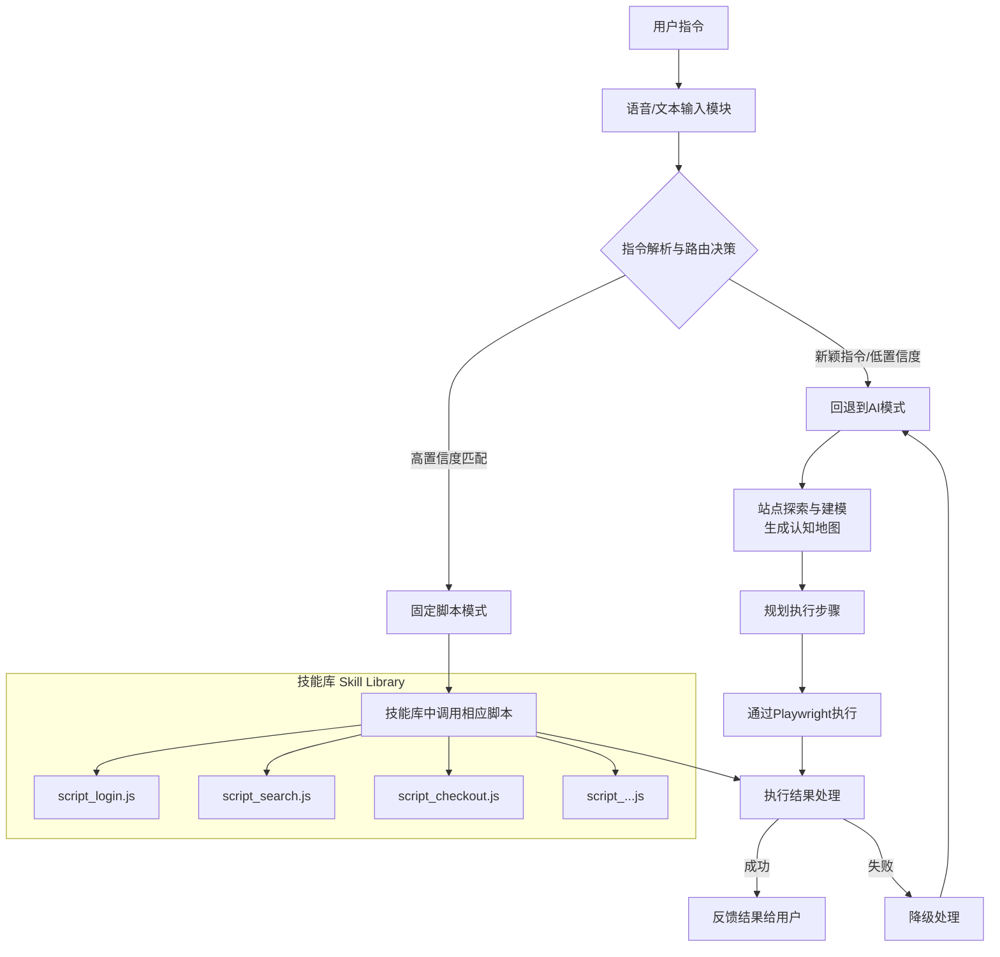
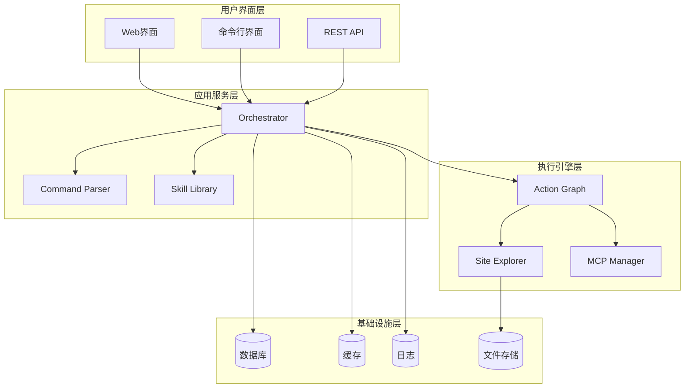

# Aura 系统概览

## 项目愿景

构建一个通过自然语言（语音/文本）指令操作浏览器的智能系统，能够理解用户意图，在复杂网站中可靠地执行多步任务，如同一个数字助手。

## 核心价值

- **无障碍交互**：通过自然语言降低自动化操作的技术门槛
- **智能导航**：在未知或复杂网站中自主探索和定位目标
- **稳定执行**：结合AI灵活性与脚本可靠性，实现工业级稳定性
- **高效复用**：将成功操作固化为可共享的"技能"，持续积累价值

## 系统架构

本系统采用"混合智能"架构，结合AI的认知能力与脚本的执行可靠性，其完整工作流程如下：

## 核心组件

### 1. 指令处理层
- **语音/文本输入模块**：多模态输入接口
- **指令解析器**：自然语言理解和意图识别
- **路由决策器**：选择最优执行策略

### 2. 智能执行层
- **AI动态规划模式**：处理新颖和复杂任务
- **固定脚本模式**：执行已知和高频任务
- **混合模式**：结合两种模式的优势

### 3. 核心引擎
- **Orchestrator**：任务调度和生命周期管理
- **Action Graph Engine**：可验证的执行图引擎
- **Site Explorer**：网站探索和建模
- **Skill Library**：技能包管理和复用

### 4. 支撑系统
- **Policy Engine**：策略和权限控制
- **Risk Engine**：风险评估和安全防护
- **MCP Manager**：多协议连接管理
- **Error Handler**：错误处理和恢复

## 技术栈

### 核心技术
- **Python 3.9+**：主要开发语言
- **FastAPI**：Web API框架
- **Playwright**：浏览器自动化
- **MCP Protocol**：模型-控制器-协议标准

### AI/ML组件
- **LLM集成**：支持多种大语言模型
- **自然语言处理**：指令解析和理解
- **机器学习**：模式识别和优化

### 数据存储
- **SQLite/PostgreSQL**：结构化数据存储
- **Redis**：缓存和会话管理
- **文件系统**：模型和日志存储

## 部署架构

## 关键特性

### 1. 混合智能架构
- AI动态规划处理复杂场景
- 固定脚本保证执行可靠性
- 智能路由优化性能

### 2. 可扩展设计
- 模块化架构便于扩展
- 插件化技能包系统
- 标准化MCP协议接口

### 3. 企业级可靠性
- 完整的错误处理机制
- 自动重连和故障恢复
- 详细的审计日志

### 4. 用户友好
- 自然语言交互
- 实时执行反馈
- 可视化操作过程

## 性能指标

- **成功率**：目标 ≥95%
- **响应时间**：P95 < 10秒
- **重试率**：< 5%
- **可用性**：99.9%

## 安全考虑

- **权限控制**：基于角色的访问控制
- **数据保护**：敏感数据加密存储
- **审计跟踪**：完整的操作日志
- **风险评估**：实时风险监控和预警

---

> 📖 **相关文档**
> - [架构决策记录 (ADR)](./architecture-decisions.md)
> - [API接口文档](./api-reference.md)
> - [开发指南](./development-guide.md)
> - [部署文档](./deployment.md)