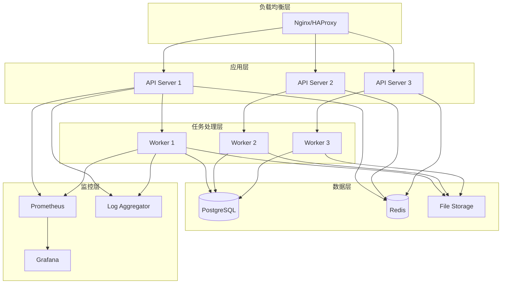

# 技术规范文档

本文档详细描述了 Aura 系统的技术实现规范，包括代码结构、数据模型、接口规范、性能要求等。

## 目录

- [系统架构](#系统架构)
- [核心模块规范](#核心模块规范)
- [数据模型](#数据模型)
- [接口规范](#接口规范)
- [性能要求](#性能要求)
- [安全规范](#安全规范)
- [编码规范](#编码规范)
- [测试规范](#测试规范)

---

## 系统架构

### 技术栈

| 组件 | 技术选型 | 版本要求 | 说明 |
|------|---------|----------|------|
| **运行时** | Python | 3.9+ | 主要编程语言 |
| **Web框架** | FastAPI | 0.104+ | API服务框架 |
| **异步处理** | asyncio | 内置 | 异步编程支持 |
| **数据库** | SQLite/PostgreSQL | 3.35+/13+ | 数据持久化 |
| **缓存** | Redis | 6.0+ | 缓存和会话存储 |
| **消息队列** | Celery + Redis | 5.3+ | 异步任务处理 |
| **浏览器自动化** | Playwright | 1.40+ | 浏览器控制 |
| **MCP协议** | MCP SDK | 1.0+ | 模型上下文协议 |
| **监控** | Prometheus + Grafana | 2.40+/9.0+ | 系统监控 |
| **日志** | structlog | 23.1+ | 结构化日志 |
| **配置管理** | Pydantic Settings | 2.0+ | 配置验证 |

### 部署架构



---

## 核心模块规范

### Orchestrator 模块

#### 类结构

```python
from abc import ABC, abstractmethod
from typing import Dict, List, Optional, Any
from enum import Enum
from dataclasses import dataclass
from datetime import datetime

class ExecutionMode(Enum):
    """执行模式枚举"""
    AI_MODE = "ai_mode"          # AI动态规划模式
    SCRIPT_MODE = "script_mode"  # 固定脚本模式
    HYBRID_MODE = "hybrid_mode"  # 混合模式

class TaskStatus(Enum):
    """任务状态枚举"""
    PENDING = "pending"          # 等待执行
    RUNNING = "running"          # 正在执行
    COMPLETED = "completed"      # 执行完成
    FAILED = "failed"            # 执行失败
    CANCELLED = "cancelled"      # 已取消
    TIMEOUT = "timeout"          # 执行超时

class TaskPriority(Enum):
    """任务优先级枚举"""
    HIGH = "high"
    MEDIUM = "medium"
    LOW = "low"

@dataclass
class TaskRequest:
    """任务请求数据结构"""
    task_id: str
    description: str
    target_url: str
    execution_mode: ExecutionMode
    parameters: Dict[str, Any]
    priority: TaskPriority = TaskPriority.MEDIUM
    timeout: int = 300  # 默认5分钟超时
    retry_count: int = 3
    callback_url: Optional[str] = None
    metadata: Dict[str, Any] = None

@dataclass
class TaskResult:
    """任务结果数据结构"""
    task_id: str
    status: TaskStatus
    result: Dict[str, Any]
    execution_time: float
    error_message: Optional[str] = None
    action_graph: Optional['ActionGraph'] = None
    screenshots: List[str] = None
    logs: List['LogEntry'] = None
    created_at: datetime = None
    completed_at: Optional[datetime] = None

class IOrchestrator(ABC):
    """编排器接口"""
    
    @abstractmethod
    async def create_task(self, request: TaskRequest) -> str:
        """创建任务"""
        pass
    
    @abstractmethod
    async def execute_task(self, task_id: str) -> TaskResult:
        """执行任务"""
        pass
    
    @abstractmethod
    async def get_task_status(self, task_id: str) -> TaskStatus:
        """获取任务状态"""
        pass
    
    @abstractmethod
    async def cancel_task(self, task_id: str) -> bool:
        """取消任务"""
        pass
    
    @abstractmethod
    async def decide_execution_strategy(self, request: TaskRequest) -> ExecutionMode:
        """决策执行策略"""
        pass

class Orchestrator(IOrchestrator):
    """编排器实现"""
    
    def __init__(self, 
                 skill_library: 'ISkillLibrary',
                 site_registry: 'ISiteModelRegistry',
                 action_engine: 'IActionGraphEngine',
                 policy_engine: 'IPolicyEngine',
                 mcp_manager: 'IMCPManager'):
        self.skill_library = skill_library
        self.site_registry = site_registry
        self.action_engine = action_engine
        self.policy_engine = policy_engine
        self.mcp_manager = mcp_manager
        self._tasks: Dict[str, TaskRequest] = {}
        self._results: Dict[str, TaskResult] = {}
    
    async def create_task(self, request: TaskRequest) -> str:
        """创建任务实现"""
        # 验证请求参数
        await self._validate_request(request)
        
        # 策略检查
        policy_result = await self.policy_engine.evaluate(
            action_type="task_creation",
            context={"request": request}
        )
        
        if not policy_result.allowed:
            raise PolicyViolationError(policy_result.reason)
        
        # 存储任务
        self._tasks[request.task_id] = request
        
        # 异步执行
        asyncio.create_task(self._execute_task_async(request.task_id))
        
        return request.task_id
    
    async def _execute_task_async(self, task_id: str) -> None:
        """异步执行任务"""
        try:
            result = await self.execute_task(task_id)
            self._results[task_id] = result
            
            # 发送回调
            if self._tasks[task_id].callback_url:
                await self._send_callback(task_id, result)
                
        except Exception as e:
            error_result = TaskResult(
                task_id=task_id,
                status=TaskStatus.FAILED,
                result={},
                execution_time=0,
                error_message=str(e)
            )
            self._results[task_id] = error_result
```

#### 性能要求

| 指标 | 要求 | 说明 |
|------|------|------|
| 任务创建延迟 | < 100ms | 从请求到返回task_id |
| 任务执行吞吐 | > 50 tasks/min | 并发执行能力 |
| 内存使用 | < 512MB | 单个Orchestrator实例 |
| CPU使用率 | < 80% | 正常负载下 |

### Action Graph Engine 模块

#### 数据结构

```python
from typing import List, Dict, Any, Optional
from enum import Enum
from dataclasses import dataclass

class NodeType(Enum):
    """节点类型"""
    ACTION = "action"        # 动作节点
    CONDITION = "condition"  # 条件节点
    LOOP = "loop"           # 循环节点
    PARALLEL = "parallel"   # 并行节点
    WAIT = "wait"           # 等待节点

class NodeStatus(Enum):
    """节点状态"""
    PENDING = "pending"      # 等待执行
    RUNNING = "running"      # 正在执行
    COMPLETED = "completed"  # 执行完成
    FAILED = "failed"        # 执行失败
    SKIPPED = "skipped"      # 已跳过
    CANCELLED = "cancelled"  # 已取消

@dataclass
class Action:
    """动作定义"""
    action_type: str  # click, type, wait, navigate, etc.
    target: str       # 目标元素或URL
    parameters: Dict[str, Any] = None
    timeout: int = 30
    retry_count: int = 3
    assertions: List['AssertionRule'] = None

@dataclass
class ActionNode:
    """动作节点"""
    node_id: str
    node_type: NodeType
    action: Optional[Action] = None
    condition: Optional[str] = None  # 条件表达式
    status: NodeStatus = NodeStatus.PENDING
    dependencies: List[str] = None   # 依赖的节点ID
    result: Dict[str, Any] = None
    error_message: Optional[str] = None
    execution_time: float = 0
    retry_config: Optional['RetryConfig'] = None

@dataclass
class ActionEdge:
    """动作边"""
    from_node: str
    to_node: str
    condition: str = "success"  # success, failure, always
    weight: float = 1.0

@dataclass
class ActionGraph:
    """动作图"""
    graph_id: str
    nodes: List[ActionNode]
    edges: List[ActionEdge]
    variables: Dict[str, Any] = None
    metadata: Dict[str, Any] = None
    created_at: datetime = None
    
    def get_executable_nodes(self) -> List[ActionNode]:
        """获取可执行的节点"""
        executable = []
        for node in self.nodes:
            if node.status == NodeStatus.PENDING:
                # 检查依赖是否满足
                if self._dependencies_satisfied(node):
                    executable.append(node)
        return executable
    
    def _dependencies_satisfied(self, node: ActionNode) -> bool:
        """检查节点依赖是否满足"""
        if not node.dependencies:
            return True
        
        for dep_id in node.dependencies:
            dep_node = self.get_node(dep_id)
            if dep_node.status != NodeStatus.COMPLETED:
                return False
        return True
```

#### 执行引擎

```python
class IActionGraphEngine(ABC):
    """动作图执行引擎接口"""
    
    @abstractmethod
    async def execute_graph(self, graph: ActionGraph) -> Dict[str, Any]:
        """执行动作图"""
        pass
    
    @abstractmethod
    async def execute_node(self, node: ActionNode, context: Dict[str, Any]) -> Dict[str, Any]:
        """执行单个节点"""
        pass
    
    @abstractmethod
    async def validate_graph(self, graph: ActionGraph) -> List[str]:
        """验证动作图"""
        pass

class ActionGraphEngine(IActionGraphEngine):
    """动作图执行引擎实现"""
    
    def __init__(self, mcp_manager: 'IMCPManager'):
        self.mcp_manager = mcp_manager
        self.executor_pool = ThreadPoolExecutor(max_workers=10)
    
    async def execute_graph(self, graph: ActionGraph) -> Dict[str, Any]:
        """执行动作图"""
        # 验证图结构
        validation_errors = await self.validate_graph(graph)
        if validation_errors:
            raise GraphValidationError(validation_errors)
        
        execution_context = {
            "graph_id": graph.graph_id,
            "variables": graph.variables or {},
            "start_time": datetime.now(),
            "screenshots": [],
            "logs": []
        }
        
        try:
            # 执行图
            while True:
                executable_nodes = graph.get_executable_nodes()
                if not executable_nodes:
                    break
                
                # 并行执行可执行节点
                tasks = []
                for node in executable_nodes:
                    task = asyncio.create_task(
                        self._execute_node_with_context(node, execution_context)
                    )
                    tasks.append(task)
                
                # 等待所有任务完成
                results = await asyncio.gather(*tasks, return_exceptions=True)
                
                # 处理结果
                for i, result in enumerate(results):
                    node = executable_nodes[i]
                    if isinstance(result, Exception):
                        node.status = NodeStatus.FAILED
                        node.error_message = str(result)
                    else:
                        node.status = NodeStatus.COMPLETED
                        node.result = result
            
            # 检查执行结果
            failed_nodes = [n for n in graph.nodes if n.status == NodeStatus.FAILED]
            if failed_nodes:
                raise GraphExecutionError(f"执行失败的节点: {[n.node_id for n in failed_nodes]}")
            
            return {
                "success": True,
                "execution_time": (datetime.now() - execution_context["start_time"]).total_seconds(),
                "screenshots": execution_context["screenshots"],
                "logs": execution_context["logs"],
                "variables": execution_context["variables"]
            }
            
        except Exception as e:
            return {
                "success": False,
                "error": str(e),
                "execution_time": (datetime.now() - execution_context["start_time"]).total_seconds(),
                "screenshots": execution_context["screenshots"],
                "logs": execution_context["logs"]
            }
```

---

## 数据模型

### 数据库设计

#### 任务表 (tasks)

```sql
CREATE TABLE tasks (
    id UUID PRIMARY KEY DEFAULT gen_random_uuid(),
    task_id VARCHAR(255) UNIQUE NOT NULL,
    description TEXT NOT NULL,
    target_url TEXT NOT NULL,
    execution_mode VARCHAR(50) NOT NULL,
    parameters JSONB,
    priority VARCHAR(20) DEFAULT 'medium',
    status VARCHAR(20) DEFAULT 'pending',
    timeout_seconds INTEGER DEFAULT 300,
    retry_count INTEGER DEFAULT 3,
    callback_url TEXT,
    metadata JSONB,
    created_at TIMESTAMP WITH TIME ZONE DEFAULT NOW(),
    updated_at TIMESTAMP WITH TIME ZONE DEFAULT NOW(),
    started_at TIMESTAMP WITH TIME ZONE,
    completed_at TIMESTAMP WITH TIME ZONE
);

CREATE INDEX idx_tasks_status ON tasks(status);
CREATE INDEX idx_tasks_created_at ON tasks(created_at);
CREATE INDEX idx_tasks_priority ON tasks(priority);
```

#### 任务结果表 (task_results)

```sql
CREATE TABLE task_results (
    id UUID PRIMARY KEY DEFAULT gen_random_uuid(),
    task_id VARCHAR(255) REFERENCES tasks(task_id),
    result JSONB,
    execution_time FLOAT,
    error_message TEXT,
    action_graph JSONB,
    screenshots TEXT[],
    logs JSONB,
    created_at TIMESTAMP WITH TIME ZONE DEFAULT NOW()
);

CREATE INDEX idx_task_results_task_id ON task_results(task_id);
```

#### 技能包表 (skills)

```sql
CREATE TABLE skills (
    id UUID PRIMARY KEY DEFAULT gen_random_uuid(),
    name VARCHAR(255) UNIQUE NOT NULL,
    version VARCHAR(50) NOT NULL,
    description TEXT,
    author VARCHAR(255),
    tags TEXT[],
    manifest JSONB NOT NULL,
    parameters_schema JSONB,
    assertions JSONB,
    dependencies TEXT[],
    compatibility JSONB,
    rating FLOAT DEFAULT 0,
    downloads INTEGER DEFAULT 0,
    created_at TIMESTAMP WITH TIME ZONE DEFAULT NOW(),
    updated_at TIMESTAMP WITH TIME ZONE DEFAULT NOW(),
    UNIQUE(name, version)
);

CREATE INDEX idx_skills_name ON skills(name);
CREATE INDEX idx_skills_tags ON skills USING GIN(tags);
CREATE INDEX idx_skills_rating ON skills(rating DESC);
```

#### 网站模型表 (site_models)

```sql
CREATE TABLE site_models (
    id UUID PRIMARY KEY DEFAULT gen_random_uuid(),
    site_id VARCHAR(255) UNIQUE NOT NULL,
    domain VARCHAR(255) NOT NULL,
    version VARCHAR(50) NOT NULL,
    elements JSONB NOT NULL,
    workflows JSONB,
    metadata JSONB,
    confidence FLOAT DEFAULT 0,
    last_verified TIMESTAMP WITH TIME ZONE,
    created_at TIMESTAMP WITH TIME ZONE DEFAULT NOW(),
    updated_at TIMESTAMP WITH TIME ZONE DEFAULT NOW()
);

CREATE INDEX idx_site_models_domain ON site_models(domain);
CREATE INDEX idx_site_models_version ON site_models(version);
```

### 缓存设计

#### Redis 键命名规范

```
# 任务相关
task:{task_id}:status          # 任务状态
task:{task_id}:result          # 任务结果
task:{task_id}:lock            # 任务锁
tasks:queue:{priority}         # 任务队列

# 会话相关
session:{session_id}:context   # 会话上下文
session:{session_id}:variables # 会话变量

# 网站模型缓存
site:{domain}:model:v{version} # 网站模型
site:{domain}:elements         # 元素缓存

# MCP连接状态
mcp:{server_name}:status       # MCP服务器状态
mcp:{server_name}:health       # 健康检查

# 限流
rate_limit:{user_id}:{endpoint} # 用户限流
rate_limit:global:{endpoint}    # 全局限流
```

#### 缓存策略

| 数据类型 | TTL | 策略 | 说明 |
|---------|-----|------|------|
| 任务状态 | 1小时 | LRU | 活跃任务状态 |
| 任务结果 | 24小时 | LRU | 完成任务结果 |
| 网站模型 | 7天 | LFU | 网站结构模型 |
| 会话数据 | 30分钟 | TTL | 用户会话 |
| MCP状态 | 5分钟 | TTL | 连接状态 |

---

## 接口规范

### RESTful API 设计原则

1. **资源导向**: URL表示资源，HTTP方法表示操作
2. **状态码规范**: 正确使用HTTP状态码
3. **版本控制**: 通过URL路径进行版本控制 (`/api/v1/`)
4. **统一响应格式**: 所有API返回统一的JSON格式
5. **错误处理**: 统一的错误响应格式

### API 响应格式

#### 成功响应

```json
{
    "success": true,
    "data": {
        // 具体数据
    },
    "meta": {
        "timestamp": "2024-01-15T10:30:00Z",
        "request_id": "req_123456",
        "version": "v1"
    }
}
```

#### 错误响应

```json
{
    "success": false,
    "error": {
        "code": "VALIDATION_ERROR",
        "message": "请求参数验证失败",
        "details": {
            "field": "target_url",
            "reason": "URL格式无效"
        }
    },
    "meta": {
        "timestamp": "2024-01-15T10:30:00Z",
        "request_id": "req_123456",
        "version": "v1"
    }
}
```

### 分页响应

```json
{
    "success": true,
    "data": {
        "items": [...],
        "pagination": {
            "page": 1,
            "limit": 20,
            "total": 100,
            "pages": 5,
            "has_next": true,
            "has_prev": false
        }
    }
}
```

---

## 性能要求

### 响应时间要求

| 接口类型 | 目标响应时间 | 最大响应时间 |
|---------|-------------|-------------|
| 任务创建 | < 100ms | < 500ms |
| 任务查询 | < 50ms | < 200ms |
| 技能包查询 | < 100ms | < 300ms |
| 网站模型查询 | < 200ms | < 1s |
| 动作图执行 | < 5s | < 30s |

### 吞吐量要求

| 操作类型 | 目标QPS | 峰值QPS |
|---------|---------|--------|
| API查询 | 1000 | 2000 |
| 任务创建 | 100 | 500 |
| 任务执行 | 50 | 100 |
| MCP调用 | 200 | 500 |

### 资源使用要求

| 资源类型 | 正常使用 | 峰值使用 | 限制 |
|---------|---------|---------|------|
| CPU | < 60% | < 80% | 4核 |
| 内存 | < 2GB | < 4GB | 8GB |
| 磁盘IO | < 100MB/s | < 500MB/s | SSD |
| 网络IO | < 50MB/s | < 200MB/s | 1Gbps |

---

## 安全规范

### 认证与授权

1. **API密钥认证**: 用于服务间调用
2. **JWT令牌认证**: 用于用户会话
3. **OAuth2.0**: 用于第三方集成
4. **RBAC权限模型**: 基于角色的访问控制

### 数据安全

1. **敏感数据加密**: 密码、令牌等敏感信息加密存储
2. **传输加密**: 所有API调用使用HTTPS
3. **数据脱敏**: 日志中敏感信息脱敏
4. **访问审计**: 记录所有敏感操作

### 安全配置

```python
# 安全配置示例
SECURITY_CONFIG = {
    "encryption": {
        "algorithm": "AES-256-GCM",
        "key_rotation_days": 90
    },
    "jwt": {
        "algorithm": "RS256",
        "expiration_hours": 24,
        "refresh_expiration_days": 30
    },
    "rate_limiting": {
        "default_limit": "1000/hour",
        "burst_limit": "100/minute",
        "sensitive_endpoints": "10/minute"
    },
    "cors": {
        "allowed_origins": ["https://app.example.com"],
        "allowed_methods": ["GET", "POST", "PUT", "DELETE"],
        "allowed_headers": ["Authorization", "Content-Type"]
    }
}
```

---

## 编码规范

### Python 编码规范

1. **PEP 8**: 遵循Python官方编码规范
2. **类型注解**: 所有函数和方法使用类型注解
3. **文档字符串**: 使用Google风格的docstring
4. **异常处理**: 明确的异常类型和处理
5. **日志记录**: 结构化日志记录

### 代码示例

```python
from typing import Dict, List, Optional, Any
from dataclasses import dataclass
import structlog

logger = structlog.get_logger(__name__)

class TaskExecutionError(Exception):
    """任务执行异常"""
    
    def __init__(self, task_id: str, message: str, details: Optional[Dict[str, Any]] = None):
        self.task_id = task_id
        self.message = message
        self.details = details or {}
        super().__init__(f"Task {task_id} execution failed: {message}")

@dataclass
class ExecutionResult:
    """执行结果数据类
    
    Attributes:
        success: 执行是否成功
        result: 执行结果数据
        execution_time: 执行耗时（秒）
        error_message: 错误信息（如果失败）
    """
    success: bool
    result: Dict[str, Any]
    execution_time: float
    error_message: Optional[str] = None

class TaskExecutor:
    """任务执行器
    
    负责执行各种类型的任务，包括AI模式、脚本模式和混合模式。
    """
    
    def __init__(self, config: Dict[str, Any]):
        """初始化任务执行器
        
        Args:
            config: 执行器配置
            
        Raises:
            ValueError: 配置参数无效时抛出
        """
        self.config = config
        self._validate_config()
        logger.info("TaskExecutor initialized", config=config)
    
    async def execute_task(self, 
                          task_id: str, 
                          task_type: str, 
                          parameters: Dict[str, Any]) -> ExecutionResult:
        """执行任务
        
        Args:
            task_id: 任务ID
            task_type: 任务类型
            parameters: 任务参数
            
        Returns:
            ExecutionResult: 执行结果
            
        Raises:
            TaskExecutionError: 任务执行失败时抛出
            ValueError: 参数无效时抛出
        """
        start_time = time.time()
        
        try:
            logger.info("Starting task execution", 
                       task_id=task_id, 
                       task_type=task_type)
            
            # 参数验证
            self._validate_parameters(parameters)
            
            # 执行任务
            result = await self._execute_task_internal(task_id, task_type, parameters)
            
            execution_time = time.time() - start_time
            
            logger.info("Task execution completed", 
                       task_id=task_id, 
                       execution_time=execution_time)
            
            return ExecutionResult(
                success=True,
                result=result,
                execution_time=execution_time
            )
            
        except Exception as e:
            execution_time = time.time() - start_time
            error_msg = str(e)
            
            logger.error("Task execution failed", 
                        task_id=task_id, 
                        error=error_msg, 
                        execution_time=execution_time)
            
            if isinstance(e, TaskExecutionError):
                raise
            else:
                raise TaskExecutionError(task_id, error_msg) from e
    
    def _validate_config(self) -> None:
        """验证配置参数"""
        required_keys = ['timeout', 'retry_count', 'max_workers']
        for key in required_keys:
            if key not in self.config:
                raise ValueError(f"Missing required config key: {key}")
    
    def _validate_parameters(self, parameters: Dict[str, Any]) -> None:
        """验证任务参数"""
        if not isinstance(parameters, dict):
            raise ValueError("Parameters must be a dictionary")
        
        # 具体的参数验证逻辑
        pass
    
    async def _execute_task_internal(self, 
                                   task_id: str, 
                                   task_type: str, 
                                   parameters: Dict[str, Any]) -> Dict[str, Any]:
        """内部任务执行逻辑"""
        # 具体的执行逻辑
        pass
```

### 项目结构规范

```
src/
├── aura/
│   ├── __init__.py
│   ├── core/                    # 核心模块
│   │   ├── __init__.py
│   │   ├── orchestrator.py      # 编排器
│   │   ├── action_graph.py      # 动作图引擎
│   │   └── exceptions.py        # 异常定义
│   ├── skills/                  # 技能包模块
│   │   ├── __init__.py
│   │   ├── library.py           # 技能库
│   │   ├── registry.py          # 技能注册
│   │   └── executor.py          # 技能执行器
│   ├── sites/                   # 网站模型模块
│   │   ├── __init__.py
│   │   ├── registry.py          # 网站模型注册
│   │   ├── explorer.py          # 网站探索
│   │   └── models.py            # 数据模型
│   ├── mcp/                     # MCP模块
│   │   ├── __init__.py
│   │   ├── manager.py           # MCP管理器
│   │   ├── client.py            # MCP客户端
│   │   └── protocols.py         # 协议定义
│   ├── policy/                  # 策略引擎
│   │   ├── __init__.py
│   │   ├── engine.py            # 策略引擎
│   │   ├── rules.py             # 规则定义
│   │   └── evaluator.py         # 规则评估器
│   ├── api/                     # API模块
│   │   ├── __init__.py
│   │   ├── routes/              # 路由定义
│   │   ├── middleware.py        # 中间件
│   │   └── schemas.py           # API模式
│   ├── utils/                   # 工具模块
│   │   ├── __init__.py
│   │   ├── logging.py           # 日志工具
│   │   ├── config.py            # 配置管理
│   │   └── helpers.py           # 辅助函数
│   └── models/                  # 数据模型
│       ├── __init__.py
│       ├── database.py          # 数据库模型
│       └── schemas.py           # Pydantic模式
```

---

## 测试规范

### 测试策略

1. **单元测试**: 覆盖率 > 80%
2. **集成测试**: 关键流程覆盖
3. **端到端测试**: 用户场景覆盖
4. **性能测试**: 负载和压力测试
5. **安全测试**: 漏洞扫描和渗透测试

### 测试工具

| 测试类型 | 工具 | 说明 |
|---------|------|------|
| 单元测试 | pytest | Python测试框架 |
| 覆盖率 | pytest-cov | 代码覆盖率 |
| Mock | pytest-mock | 模拟对象 |
| 异步测试 | pytest-asyncio | 异步测试支持 |
| API测试 | httpx | HTTP客户端测试 |
| 性能测试 | locust | 负载测试 |
| 安全测试 | bandit | 安全漏洞扫描 |

### 测试示例

```python
import pytest
import asyncio
from unittest.mock import Mock, AsyncMock
from aura.core.orchestrator import Orchestrator, TaskRequest, ExecutionMode
from aura.core.exceptions import TaskExecutionError

class TestOrchestrator:
    """编排器测试类"""
    
    @pytest.fixture
    def orchestrator(self):
        """创建编排器实例"""
        skill_library = Mock()
        site_registry = Mock()
        action_engine = Mock()
        policy_engine = Mock()
        mcp_manager = Mock()
        
        return Orchestrator(
            skill_library=skill_library,
            site_registry=site_registry,
            action_engine=action_engine,
            policy_engine=policy_engine,
            mcp_manager=mcp_manager
        )
    
    @pytest.fixture
    def task_request(self):
        """创建任务请求"""
        return TaskRequest(
            task_id="test_task_123",
            description="测试任务",
            target_url="https://example.com",
            execution_mode=ExecutionMode.AI_MODE,
            parameters={"test": "value"}
        )
    
    @pytest.mark.asyncio
    async def test_create_task_success(self, orchestrator, task_request):
        """测试成功创建任务"""
        # 模拟策略检查通过
        orchestrator.policy_engine.evaluate = AsyncMock(return_value=Mock(allowed=True))
        
        # 执行测试
        task_id = await orchestrator.create_task(task_request)
        
        # 验证结果
        assert task_id == "test_task_123"
        assert task_request.task_id in orchestrator._tasks
        orchestrator.policy_engine.evaluate.assert_called_once()
    
    @pytest.mark.asyncio
    async def test_create_task_policy_violation(self, orchestrator, task_request):
        """测试策略违规"""
        # 模拟策略检查失败
        orchestrator.policy_engine.evaluate = AsyncMock(
            return_value=Mock(allowed=False, reason="高风险操作")
        )
        
        # 执行测试并验证异常
        with pytest.raises(PolicyViolationError) as exc_info:
            await orchestrator.create_task(task_request)
        
        assert "高风险操作" in str(exc_info.value)
    
    @pytest.mark.asyncio
    async def test_execute_task_timeout(self, orchestrator, task_request):
        """测试任务执行超时"""
        # 设置短超时时间
        task_request.timeout = 1
        
        # 模拟长时间执行
        async def slow_execution(*args, **kwargs):
            await asyncio.sleep(2)
            return {"result": "success"}
        
        orchestrator._execute_task_internal = slow_execution
        
        # 执行测试
        with pytest.raises(TaskExecutionError) as exc_info:
            await orchestrator.execute_task(task_request.task_id)
        
        assert "timeout" in str(exc_info.value).lower()
    
    def test_decide_execution_strategy(self, orchestrator, task_request):
        """测试执行策略决策"""
        # 测试不同场景的策略决策
        test_cases = [
            {
                "description": "简单表单填写",
                "target_url": "https://simple-form.com",
                "expected": ExecutionMode.SCRIPT_MODE
            },
            {
                "description": "复杂数据分析",
                "target_url": "https://complex-dashboard.com",
                "expected": ExecutionMode.AI_MODE
            },
            {
                "description": "混合操作场景",
                "target_url": "https://mixed-scenario.com",
                "expected": ExecutionMode.HYBRID_MODE
            }
        ]
        
        for case in test_cases:
            task_request.description = case["description"]
            task_request.target_url = case["target_url"]
            
            strategy = orchestrator.decide_execution_strategy(task_request)
            assert strategy == case["expected"]

# 性能测试示例
class TestPerformance:
    """性能测试类"""
    
    @pytest.mark.performance
    @pytest.mark.asyncio
    async def test_concurrent_task_creation(self, orchestrator):
        """测试并发任务创建性能"""
        import time
        
        # 创建多个任务请求
        tasks = []
        for i in range(100):
            task_request = TaskRequest(
                task_id=f"perf_test_{i}",
                description=f"性能测试任务 {i}",
                target_url="https://example.com",
                execution_mode=ExecutionMode.AI_MODE,
                parameters={"index": i}
            )
            tasks.append(task_request)
        
        # 模拟策略检查通过
        orchestrator.policy_engine.evaluate = AsyncMock(return_value=Mock(allowed=True))
        
        # 测试并发创建
        start_time = time.time()
        
        create_tasks = [orchestrator.create_task(task) for task in tasks]
        results = await asyncio.gather(*create_tasks)
        
        end_time = time.time()
        execution_time = end_time - start_time
        
        # 验证性能要求
        assert len(results) == 100
        assert execution_time < 5.0  # 100个任务创建应在5秒内完成
        
        # 计算QPS
        qps = len(results) / execution_time
        assert qps > 20  # QPS应大于20
```

---

> 📖 **相关文档**
> - [系统概览](./system-overview.md)
> - [架构决策记录](./architecture-decisions.md)
> - [API参考文档](./api-reference.md)
> - [开发指南](./development-guide.md)